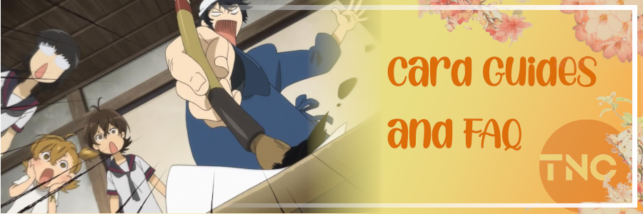

<!-- markdownlint-disable MD041 -->

 
<em>
  <a href="https://myanimelist.net/anime/22789">Barakamon</a> banner by
  <a href="https://myanimelist.net/profile/Yes_Im_Lumzing">@Yes_Im_Lumzing</a>
</em>

<h1 align="center">The Newbie Club Card Guides and FAQ</h1>

  Official Source Code for Card Guides and FAQ Forum Thread by The Newbie Club.
  <!-- Badges -->
   
   
  
  
  
  
  

 

## Contributing

SEE [CONTRIBUTING.md](CONTRIBUTING.md). For translation guide, READ [TRANSLATION.md](TRANSLATION.md).

## Localization

* [Bahasa Indonesia](i18n/id_ID.md)
* [English](i18n/en_US.md)
