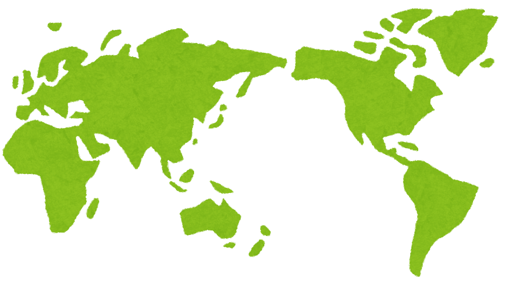
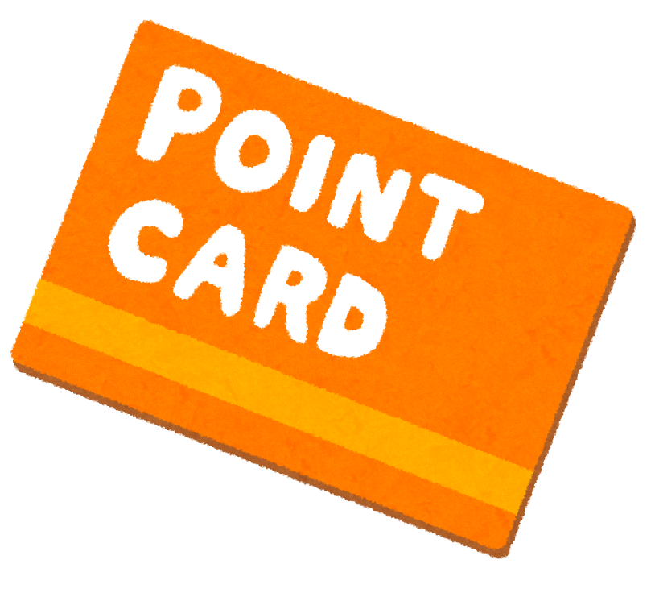
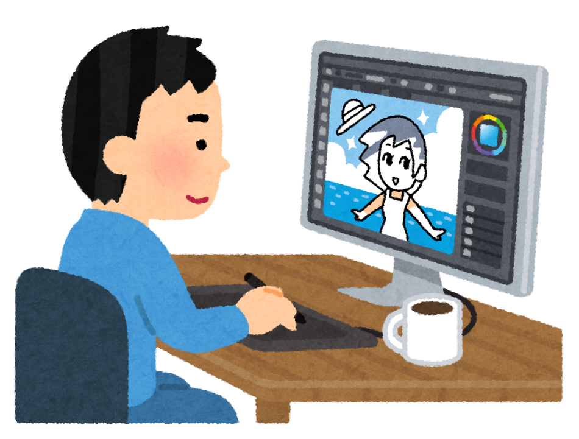

<!-- markdownlint-disable MD041 MD034 -->

![banner][banner]\
*[Barakamon][a22789] banner by [@Yes_Im_Lumzing][bannerAttribution]*

# The Newbie Club Card Guides and FAQ

## 💬 Introduction

**Welcome to The Newbie Club's Guideline for card request and frequently asked questions.**

This documentation will assist you on how to request card(s) on this club and any questions that may
frequently asked about.

To begin, read contents below one-by-one.

### 🌐 Translation

We also provide translation for this documentation. To read this in your language, check
[languageContent.md](languageContent.md).

  

## 📃 Index

* [The Newbie Club Card Guides and FAQ](#the-newbie-club-card-guides-and-faq)
  * [💬 Introduction](#-introduction)
    * [🌐 Translation](#-translation)
  * [📃 Index](#-index)
  * [⚖ Legal](#-legal)
* [About: Cards](#about-cards)
  * [💳 What is card?](#-what-is-card)
  * [Lorem Ipsum](#lorem-ipsum)
  * [👣 Footnotes](#-footnotes)

## ⚖ Legal

This documentation is published under [Creative Commons Attribution (BY) 4.0][CCBY40] license.

Clip arts on this documentation are copyrighted materials used under non-commercial purpose.

<!-- START: DO NOT TRANSLATE THIS COPYRIGHT NOTICE -->
**COPYRIGHT © 2021 Irasutoya. All Rights Reserved.**\
**© 2021 いらすとや**

Homepage/ホームページ: https://irasutoya.com
<!-- END: TRANSLATION RESTRICTION -->

<!-- Links -->
[banner]: ../assets/banner/banner.png
[CCBY40]: ../LICENSE
[a22789]: https://myanimelist.net/anime/22789
[bannerAttribution]: https://myanimelist.net/profile/Yes_Im_Lumzing

# About: Cards

## 💳 What is card?

**Cards** or **card editions** are a club thing that don’t serve a real purpose, but are rather
collectibles that you can, for example, just save, show off in a blog post on MAL such as in this
example here, or display them in your MAL profile, your forum signature, etc.<a href="#fn1">1</a>

We don't have a definite answer on how it became a thing but it's in a lot of other clubs as well.
This is just one of them.

Graphic designers use programs such as Adobe Photoshop, Krita, GIMP, and Paint.NET (or any editing
program<!-- including Microsoft PowerPoint :o-->) to make cards.

Members collect them for these vary reasons:

1. Show off in a blog.
2. The sake of having a collection.
3. Admire the cards made by different designers.

The card design you will get is same as what you requested with your username in
it.<a href="#fn2">2</a>

## Lorem Ipsum

## 👣 Footnotes

1.  [The Newbie Club Discussion - FAQs](https://myanimelist.net/forum/?topicid=1779538)
2.  [TY answers regarding cards](https://discord.com/channels/449172244724449290/534122024860123182/546412983417307154)
