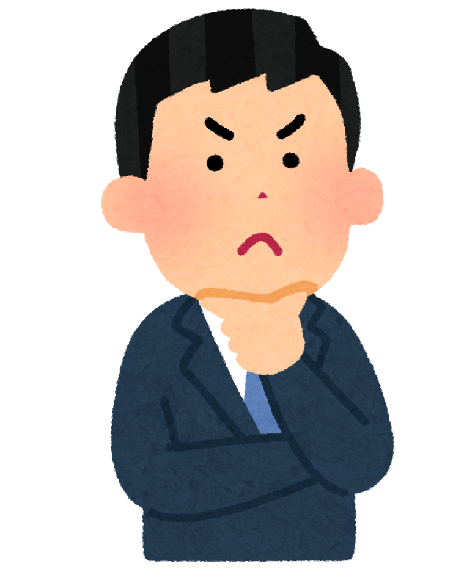
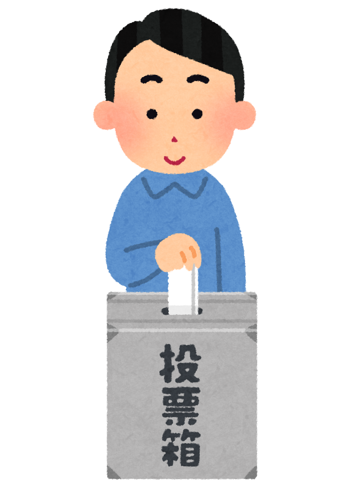

<!-- markdownlint-disable MD041 MD034 MD027 MD013 MD035 -->
<!-- cSpell:ignore aisatsu, boushi, kangaechu, kouji, nimotsu, saikoro, sekaichizu, shinnen, takujou, touhyou, yuudoubou, chuui, senkyo -->

<!-- CARDFAQ:PAGE 1 /-->

<br />
<sup><em>
  <a href="https://myanimelist.net/anime/22789">Barakamon</a> banner by
  <a href="https://myanimelist.net/profile/Yes_Im_Lumzing">@Yes_Im_Lumzing</a>
</em></sup>

# The Newbie Club Card Guides and FAQ

## 💬 Introduction


**Welcome to The Newbie Club's Guideline for card request and frequently asked questions.**

This documentation will assist you in requesting cards on this club and any questions that may be
frequently asked.

To begin, read the contents below one-by-one.

*We encourage you to use the desktop version for a better experience.*


### 🌐 Translation

We also provide translations for this documentation. To read this in your language, check
[languageContent.md][i18n].

<br /><br />

## 📃 Index

<!-- cSpell:disable -->

<details><summary>See the index</summary>

* [The Newbie Club Card Guides and FAQ](#the-newbie-club-card-guides-and-faq)
  * [💬 Introduction](#-introduction)
    * [🌐 Translation](#-translation)
  * [📃 Index](#-index)
  * [🎉 Acknowledgement](#-acknowledgement)
  * [⚖️ Legal](#️-legal)
* [About: Cards](#about-cards)
  * [💳 What is a card?](#-what-is-a-card)
  * [✉️ How to get the cards?](#️-how-to-get-the-cards)
  * [❓ What are those random texts inside brackets?](#-what-are-those-random-texts-inside-brackets)
  * [🤔 Can I remove some "questions" on the forms?](#-can-i-remove-some-questions-on-the-forms)
  * [↩️ Can I get cards from the previous edition?](#️-can-i-get-cards-from-the-previous-edition)
  * [🉑 Do I still have a chance to get the card if I send the request after request limit and/or after the deadline?](#-do-i-still-have-a-chance-to-get-the-card-if-i-send-the-request-after-request-limit-andor-after-the-deadline)
* [About: Limit](#about-limit)
  * [🛑 What is the card limit?](#-what-is-the-card-limit)
  * [⛔ What is the request limit?](#-what-is-the-request-limit)
  * [🆙 Why is the card limit for staff greater than regular members?](#-why-is-the-card-limit-for-staff-greater-than-regular-members)
* [About: Scheduling and Edition Theme](#about-scheduling-and-edition-theme)
  * [🗓️ When is usually an edition released?](#️-when-is-usually-an-edition-released)
  * [⌚ How long is the period for each edition release?](#-how-long-is-the-period-for-each-edition-release)
  * [🎨 Which theme does The Newbie Club usually release for the card edition?](#-which-theme-does-the-newbie-club-usually-release-for-the-card-edition)
* [About: Rules Enforcement](#about-rules-enforcement)
  * [📕 What rules for requesting the cards? Can you explain it?](#-what-rules-for-requesting-the-cards-can-you-explain-it)
  * [⚠️ Why did one of the staff send me a warning to my PM?](#️-why-did-one-of-the-staff-send-me-a-warning-to-my-pm)
  * [🚶‍♂️ I saw someone *bypassed* the limit by adding plus (+), what is it?](#️-i-saw-someone-bypassed-the-limit-by-adding-plus--what-is-it)
  * [🕵️‍♂️ I have an issue with one or more cards, where I can speak to?](#️️-i-have-an-issue-with-one-or-more-cards-where-i-can-speak-to)
  * [🙅‍♂️ My content was being used without permission; where can I submit a takedown request?](#️-my-content-was-being-used-without-permission-where-can-i-submit-a-takedown-request)
* [About: Delivery and Usage](#about-delivery-and-usage)
  * [🚛 When can I get my cards?](#-when-can-i-get-my-cards)
  * [😢 What should I do when I didn't receive the card?](#-what-should-i-do-when-i-didnt-receive-the-card)
  * [🖼️ Where can I put the cards?](#️-where-can-i-put-the-cards)
* [About: Signature Shortcut](#about-signature-shortcut)
  * [🔗 Can I ask the deliverer to look up the delivery link on my forum signature?](#-can-i-ask-the-deliverer-to-look-up-the-delivery-link-on-my-forum-signature)
  * [📜 Is there any guideline for it?](#-is-there-any-guideline-for-it)
* [About: Suggestion](#about-suggestion)
  * [🗳️ What is the edition suggestion?](#️-what-is-the-edition-suggestion)
  * [✍ Which one can I suggest to the team?](#-which-one-can-i-suggest-to-the-team)
  * [🙋‍♂️ Can I suggest more than one title/subject in one reply/request?](#️-can-i-suggest-more-than-one-titlesubject-in-one-replyrequest)
  * [🕔 How long will the suggested edition take to be released?](#-how-long-will-the-suggested-edition-take-to-be-released)
* [About: Miscellaneous](#about-miscellaneous)
  * [Production](#production)
    * [🖌️ How does your team create the card?](#️-how-does-your-team-create-the-card)
    * [🔎 Can I know the technical information to create a card?](#-can-i-know-the-technical-information-to-create-a-card)
    * [🤖 Writing one-by-one requester's names looks pretty tedious; isn't there any automation to do it?](#-writing-one-by-one-requesters-names-looks-pretty-tedious-isnt-there-any-automation-to-do-it)
  * [Staff](#staff)
    * [👥 How can I join as a Designer or Card Deliverer?](#-how-can-i-join-as-a-designer-or-card-deliverer)
    * [🎖️ I saw an ex-staff get their personalized card for their contribution; Can I apply to get it?](#️-i-saw-an-ex-staff-get-their-personalized-card-for-their-contribution-can-i-apply-to-get-it)
  * [Slip card](#slip-card)
    * [➕ What is a slip card?](#-what-is-a-slip-card)
    * [📬 How to get a slip card?](#-how-to-get-a-slip-card)
* [Footnotes](#footnotes)

</details>

<!-- cSpell:enable -->

## 🎉 Acknowledgement


Thanks to these incredible people who helped us write this documentation. They are the best!

* [Allegedshrimp](https://myanimelist.net/profile/Allegedshrimp) — FAQ Provider
* [Cliptsu](https://myanimelist.net/profile/Cliptsu) — Proofread
* [Exelero64](https://myanimelist.net/profile/Exelero64) — Proofread
* [Karasian](https://myanimelist.net/profile/Karasian) — The Newbie Club Owner
* [kunminer123](https://myanimelist.net/profile/kunminer123) — FAQ Provider
* [RockValRon](https://myanimelist.net/profile/RockValRon) — Proofread
* [Sp3ctr](https://myanimelist.net/profile/Sp3ctr) — Quality Check &amp; FAQ Provider
* [Tachi_Kun](https://myanimelist.net/profile/Tachi_Kun) — Proofread
* [Yes_Im_Lumzing](https://myanimelist.net/profile/Yes_Im_Lumzing) — Proofread

## ⚖️ Legal


The keywords `MUST`, `MUST NOT`, `REQUIRED`, `SHALL`, `SHALL NOT`, `SHOULD`, `SHOULD NOT`,
`RECOMMENDED`, `MAY`, and `OPTIONAL` in this document are to be interpreted as described in
RFC 2119.<sup><a href="#fn1">1</a></sup>

This documentation is published under [Creative Commons Attribution (BY) 4.0][CCBY40] license.

Clip arts on this documentation are copyrighted materials used for non-commercial purposes.

<!-- START: DO NOT TRANSLATE THIS COPYRIGHT NOTICE -->
**COPYRIGHT © 2021 Irasutoya. All Rights Reserved.**\
**© 2021 いらすとや/みふねたかし**

Homepage/ホームページ: https://irasutoya.com
<!-- END: TRANSLATION RESTRICTION -->

----------------------------------------------------------------------------------------------------

<!-- CARDFAQ:PAGE 2 /-->


# About: Cards

## 💳 What is a card?


**Cards** or **card editions** are a club thing that doesn't serve a real purpose, but are rather
collectibles that you can, for example, just save, show off in a blog post on MAL such as in this
example here, or display them on your MAL profile, your forum signature,
etc.<sup><a href="#fn2">2</a></sup>

We don't have a definite answer on how it became a thing but it's in many other clubs as well; this
is just one of them.

Members collect them for these reasons:

1. Show off in a blog.
2. The sake of having a collection.
3. Admire the cards made by different designers.

The card design you will get is the same as what you requested, but with your username on
it.<sup><a href="#fn3">3</a></sup>

## ✉️ How to get the cards?
<!-- markdownlint-disable MD032 -->
Requesting a card is easy and can be done by following these steps:


* **Check if the edition is still open.**
  > You can check it by looking up the thread title. If it says `[CLOSED]` or `[HALTED]`, then
  > you're out of luck. ;-;
* **Read the instructions and rules included in the edition carefully.**
  > These instructions will assist you in requesting the cards while abiding by the rules.
1. Copy the form provided on the edition thread.
   > In some cases, user is required **not to modify** the template at all.
2. Go to the bottom/top of the thread, and look for the "Post New Reply" or "Quick Reply"
   button/link, and click it to reply.
3. Paste the form to the text box, and fill the form based on what the instruction suggests.
   > Make sure the total amount of cards you requested from each staff does not exceed the specified
   > limit.
4. Submit the request.
5. You're done!

<!-- markdownlint-enable MD032 -->

## ❓ What are those random texts inside brackets?

Those are known as BBCode tags. Simply saying, those are instructions to tell MyAnimeList which text
we want to format.

For example, if we want to make the text **bold**, we can do it by typing:

```css
[b]bold[/b]
```

You can learn more about BBCode from:

* [The Newbie Club BBCode Guide][tncBBCode]
* [MyAnimeList's Official Formatting Tips][malBBCode]
* [Shishio's BBCode Guide (with Video)][shishioBBCode]

## 🤔 Can I remove some "questions" on the forms?


Short answer, **no**.

All of those questions, excluding comments, suggestions, and feedback (if any), are required in the
request form.

In The Newbie Club, the structure must stay as it is due to the implementation of the bot.

However, you can leave it blank to avoid any conflict.

## ↩️ Can I get cards from the previous edition?

**No**. It is impossible to get previous edition's cards, UNLESS there's an ongoing re-run event.

However, the designing staff might reuse/carry the design language from the previous edition.

## 🉑 Do I still have a chance to get the card if I send the request after request limit and/or after the deadline?

**No**. Your request will be considered invalid.

----------------------------------------------------------------------------------------------------

<!-- CARDFAQ:PAGE 3 /-->


# About: Limit

## 🛑 What is the card limit?

<!-- markdownlint-disable MD022 MD024 -->

A card limit is the maximum number of cards a member can order/request from an individual designing
staff OR edition.

By default, The Newbie Club card limit is set to staff. But in some cases, the limit is set
globally (applied to the edition).<sup><a href="#fn4">4</a></sup>

You can see the limit specified by staff under their name, usually written as:
> ## Samantha
> **Member:** `x`/`y`\
> **Staff:** `x`/`y`

Or

> ## Nicolas
> **Any:** `x`/`y`

With `x` is the number of cards you can take, and `y` is the total number of cards available.

<!-- markdownlint-enable MD022 MD024 -->

## ⛔ What is the request limit?



Request limit is the maximum amount of replies/requests in an edition.

It is usually set to 100 requests per edition.

Please note that due to how MyAnimeList counts replies, you can calculate by subtracting replies
with main/first post instead and another 2<sup>nd</sup> post by poster, if any.

## 🆙 Why is the card limit for staff greater than regular members?

In short: they *work* for club, so it is absolutely understandable if they would like more cards
compared to regular members.

----------------------------------------------------------------------------------------------------

<!-- CARDFAQ:PAGE 4 /-->


# About: Scheduling and Edition Theme

## 🗓️ When is usually an edition released?

We usually release the edition bi-weekly every 1st and 3rd week of the month on Sunday at 8:00 AM up
to 11:00 AM UTC/GMT+0.

However, we might not release for a week or even a month to provide free time during the
holiday/vacation period.

## ⌚ How long is the period for each edition release?

It is 5 days, counted from the second of edition released and ended on Thursday, UNLESS under some
circumstance.

## 🎨 Which theme does The Newbie Club usually release for the card edition?

Due to the club's nature, we are focusing on introducing animanga and Japanese culture to any
newcomers.

----------------------------------------------------------------------------------------------------

<!-- CARDFAQ:PAGE 5 /-->


# About: Rules Enforcement

## 📕 What rules for requesting the cards? Can you explain it?

In TNC, we have rules for both regular members and club staff to acknowledge and obey before
requesting the cards.

Below are the rules of each edition and their definition (if required):

<!-- START: DO NOT TRANSLATE CLAUSES. ONLY DESCRIPTION ALLOWED, FEEL FREE TO ADD EXPLANATIONS -->

1. Request your cards by <u>commenting on this forum thread</u> and using a list number instead of
   naming the card.
   > This clause is self-explanatory.
   >
   > However, for "using a list number instead of naming the card," we saw some members called the
   > card by the featured figure on that card. This can result in ambiguity by bot, and the bot will
   > ignore this as it assumes as a comment.
2. Do not request cards if you have no intention of saving them AND/OR request for someone else.
   > This clause is self-explanatory.
3. Please **follow the format and respect the limits given by each card maker**, or the request
   will be deleted.
   > The limit stated in this clause is the [card limit](#-what-is-the-card-limit).
4. Due to our current automation limitation, **do not change or remove query names**. We will warn
   you if find any infringement.
   > In short, anything inside the request template can not be deleted or modified. This behavior
   > will affect our bot when fetching/taking data from a forum thread to a database.
5. If you want to claim additional card(s) using slip card AND/OR by requirement from designer,
   please use plus symbol (+) on additional card(s).
   > See [Slip Card](#slip-card).
6. In cases where your username is long and ensure your name fits, it's advised to **leave a short
   name/nickname no more than 12 characters/words**.
   > Most card designs have limited space for text fields, usually only around 12 characters.
7. **Editions are limited to** *`x`* **requests**, so it's first come, first served!
   > This clause is self-explanatory.

<!-- END: TRANSLATION RESTRICTION -->


## ⚠️ Why did one of the staff send me a warning to my PM?

We found an error on your request and/or did not obey the rules stated in the edition.

Your request was either edited to comply with bot configuration by us OR deleted if there is
exceeded amount of card requests on individual staff.

## 🚶‍♂️ I saw someone *bypassed* the limit by adding plus (+), what is it?

They used a slip card on their request. To learn more, see [Slip Card](#slip-card).

## 🕵️‍♂️ I have an issue with one or more cards, where I can speak to?

Please send a MAL PM to [@nattadasu][nattadasu] for further investigation.

## 🙅‍♂️ My content was being used without permission; where can I submit a takedown request?

Please send a takedown request to [dmca@nattadasu.my.id][mailTo]. We will try our best to take it
down within a day or earlier.

Unfortunately, the club does not have a dedicated email address at the moment.

----------------------------------------------------------------------------------------------------

<!-- CARDFAQ:PAGE 6 /-->


# About: Delivery and Usage

## 🚛 When can I get my cards?

Usually designer requires a week or more to finish all of the request, upload the files, and
distribute the cards one by one to each requester after the thread is closed.

Since it was taking too much of the designers' time to deliver the cards by themselves, we
facilitated by adding a new subsection: card deliverer.

However, in some cases, the designer cannot finish it in a week and probably will take months to
complete due to works they need to finish first.

Note that most of our club staff are teenagers and undergraduate students, and we focus more on our
education.

## 😢 What should I do when I didn't receive the card?

Before filing a complaint, please check the [Card Delivery Tracking][cardTrack] thread and read the
instructions stated on the thread.

To summarize, by checking the status:

* If the status of the designer is 🎨 **designing**, and it has been **less than 2 months** after
  the thread closed:
  > Please wait.
* If the status of the designer is 🎨 **designing**, and it has been **more than or equal to 2
  month** after the thread closed:
  > Send a MAL PM to [@nattadasu][nattadasu].
* If the status of the designer is ✅ **delivered**, but did not receive the card:
  > Send a MAL PM to the respective designer.
* If the status of the designer is ❌ **halted**:
  > Send a MAL PM to [@nattadasu][nattadasu].

## 🖼️ Where can I put the cards?

As stated earlier on [💳 What is a card](#-what-is-a-card), you can put it wherever you want!

You can put it on your MAL Blog, Profile Bio, or even create a separate website just for the album.

----------------------------------------------------------------------------------------------------

<!-- CARDFAQ:PAGE 7 /-->


# About: Signature Shortcut

## 🔗 Can I ask the deliverer to look up the delivery link on my forum signature?

**Yes**, you can! But we still recommend you to at least hyperlink "LIS"/"Blog Post" to your
respective delivery blog instead.

## 📜 Is there any guideline for it?

We have guides for it, but it is most likely common sense or gives the designer/deliverer more
accessibility.

If you are interested to know more, read the guide below:

* The link should be on the left side of the signature content.
* If the link to the blog was hyperlinked into the signature image:
  * If you have multiple hyperlinked images OR if the image was split into several parts, you **must
    explicitly state** which one is the correct link by adding text into the image itself, OR you
    can state the link's location the on comment query.
  * If you only have one image, you are not required to state the location.
* Link to blog that hyperlinked into text **must**:
  * Visible by any background, white and dark.
    > The lightness of the color must not be below 25% and above 90%.
  * Avoid font size below 40% of MyAnimeList's 13px.
  * Avoid any *fancy* font style to ensure Unicode compatibility on the designer/deliverer's end
    machine.

----------------------------------------------------------------------------------------------------

<!-- CARDFAQ:PAGE 8 /-->


# About: Suggestion

## 🗳️ What is the edition suggestion?

Edition suggestion is a suggestion to help us which topic will be released next.

The suggestion field is open for everyone, including staff, and each of them can suggest one
topic/title per submission.

## ✍ Which one can I suggest to the team?



We accept anything!<sup><a href="#fn5">5</a></sup>

You can suggest **one** of your favorite anime/manga titles, directors, voice actors, events, or
even general topics. <!-- pun unintended, ngl. -->

Please note that the chances we pick specific director's/VA's works are very low, as we embrace the
idea of introducing animanga and Japanese culture to newcomers.

## 🙋‍♂️ Can I suggest more than one title/subject in one reply/request?

Unfortunately, **no**. We want to be as fair as possible, and considering this club's primary
purpose, this is our approach.

## 🕔 How long will the suggested edition take to be released?

According to the *demand rate theory*, the more people want it (demand), the less time it takes to
release the edition; thus, the rate is greater.

Due to how we implement the system, it is a little bit different.

In TNC, there are three steps before the edition release, and it is happens after the second edition
is released to the public:

1. Requesters suggested the editions up to the minimum threshold.
   > The minimum threshold may vary by the general topic and/or audience of the suggestion is.
   >
   > If the suggested topic is a recurring event, the threshold will be skipped and automatically
   > jump to the second step.
2. When the threshold is reached, it will be listed as an option for the internal team tally. As the
   club will hold 2 editions in every month, votes in each tally are 4 up to 6.
3. Any staff of the graphic designing and delivery team, deputies of each section, and admin of each
   section will decide which edition will be released. The edition with the most votes will be
   released in the first week.
   > Also, staff might not vote the suggestion even if the edition was suggested double or more
   > times than the minimum threshold.

As our suggestion list is growing faster, unfortunately, it will take from 5 months up to a year if
the demand rate is 0.5/month.<a href="#fn6"><sup>5</sup></a>

We want those suggestions to be released ultimately, but considering the club's primary purpose
exists, it can't be helped. You could also try suggesting your specific edition suggestion to
another club whose primary purpose is collecting collectibles.

----------------------------------------------------------------------------------------------------

<!-- CARDFAQ:PAGE 9 /-->


# About: Miscellaneous

## Production


### 🖌️ How does your team create the card?

We use Adobe Photoshop for our work, but it's not required.

We allow staff to use apps other than Photoshop, like Affinity Designer, Krita, GIMP, Paint.NET,
ibisPaint, etc.

*Heck*, the GFX head himself <!--, @nattadasu, --> uses Microsoft Office PowerPoint to design his
cards, and barely anyone noticed it.

### 🔎 Can I know the technical information to create a card?

Sure!

We use this configuration for our cards:

* Allowed file format for card: PNG, A-PNG (Animated PNG), GIF, and JPEG. However, PNG is
  recommended.
* Ratio (orientation) can be landscape, portrait, or square (1:1).
* Resolution/size for the card can not exceed, based on orientation:
  * Landscape: 360x240px (3:2).
  * Portrait: 240x360px (2:3).
  * Square: 240x240px (1:1).
    > **Note:**\
    > Create your card with twice of resolution on your draft, and then rescale it back. This
    > method is to avoid any detail loss after you create it.
* Recommended using 300dpi, minimum 90dpi.
* The card should *at least* contain 3 (three) text fields/spaces:
  1. **Edition name**, e.g., "School Edition."
  2. **Club Name**, e.g., "The Newbie Club" or "TNC."
  3. **Username/Nickname**, This will be where we write the names of people who requested cards
     from the edition before delivering them.

Visit [The Newbie Club's GFX Encyclopedia][encyclopedia] if you want to learn more.


### 🤖 Writing one-by-one requester's names looks pretty tedious; isn't there any automation to do it?

As you expect, **yes**, there is an automation method to ease creating cards.

However, this method is currently limited to Adobe Photoshop. We can't find any automation feature
or script for another program.

Visit [The Newbie Club's GFX Encyclopedia][encyclopedia] if you want to learn more.

## Staff


### 👥 How can I join as a Designer or Card Deliverer?

Thanks for your interest!

Please head out to [Application Thread][staffRecruitment] if you want to join our team.

### 🎖️ I saw an ex-staff get their personalized card for their contribution; Can I apply to get it?

**Yes**, you can!

However, we have some requirements that need to be fulfilled by the ex-staff before getting the
honor card:

1. User must contribute as TNC Staff in any sections for at least 6 months or older.
   > Note: This clause will be skipped if the user was an admin or deputy of each section.
2. User must join the staff-only Discord server (S.S Remaining) during contribution, and have at
   least 1 message sent to one channel.
3. Both Discord and MAL accounts must be active/not deleted during and after the contribution.

To apply, please send a MAL PM to [@nattadasu][nattadasu] with the title "Honor Card Application"
and attach the requirements stated below:

1. Your current MAL Username and former (if any).
2. Your current Discord Username and former (if any).
3. Your Discord User ID.
   > To get your User ID, please follow the instruction [**here**][discEncyclopediaUserID].
4. Your former contributed section.

## Slip card

### ➕ What is a slip card?


A slip card is a card that allows requesters to bypass the limit with the specified amount on the
card itself. You can imagine slip card like a loyalty/membership card applied on stores.

The reason why it exists might seem unclear at first glance, but can be understood by looking at the
pattern of its usage:

1. The requester is a regular *customer*.
2. The requester adores the design made by individual staff.
3. They just like to collect cards.

On TNC, you can attach your slip card to your request by adding an image inside the spoiler box and
then explicitly stating if they own a slip card by adding an addition (+) symbol to cards.

For example:

```css
[...]
Natsu: 1, 3 + 5, 7 [spoiler="slip card"][img]https://i.imgur.com/CqaSw61.png[/img][/spoiler]
```

The above code snippet will be rendered as:

> Natsu: 1, 3 + 5, 7
> <details><summary>Show slip card</summary></details>

### 📬 How to get a slip card?

You can get the slip card by checking the designer's profile. The club does not provide a
first-party slip card store, and you must check it manually.

To ease the progress, check any links given by the designer/deliverer in their delivery message if
they have a slip card store.

----------------------------------------------------------------------------------------------------

<!-- CARDFAQ:PAGE 10 /-->

# Footnotes

1. <a id="fn1"></a> [Keywords for use in RFCs to Indicate Requirement Levels][rfc2119]
2. <a id="fn2"></a> [The Newbie Club Discussion - FAQs][faq]
3. <a id="fn3"></a> [TY answers regarding cards][tyDiscord]
4. <a id="fn4"></a> [\[CARDS\] \[CLOSED\] 🎃 TNC X HNE Halloween Collab][tncCollab]
5. <a id="fn5"></a> It must be inside ACG (Animation, Comic, Game) and Japanese culture.
6. <a id="fn6"></a> 1 person requested that particular edition in each release, and assuming the
   threshold is 10.

<!-- LINKS -->
[cardTrack]: https://myanimelist.net/forum/?topicid=1981019
[CCBY40]: ../LICENSE
[discEncyclopediaUserID]: https://support.discord.com/hc/en-us/articles/206346498-Where-can-I-find-my-User-Server-Message-ID-
[encyclopedia]: https://thenewbieclub-mal.github.io/gfxEncyclopedia
[faq]: https://myanimelist.net/forum/?topicid=1779538
[i18n]: languageContent.md
[mailTo]: mailto:dmca@nattadasu.my.id?subject=The%20Newbie%20Club%3A%20Takedown%20Request
[malBBCode]: https://myanimelist.net/info.php?go=bbcode
[nattadasu]: https://myanimelist.net/profile/nattadasu
[rfc2119]: https://datatracker.ietf.org/doc/html/rfc2119
[shishioBBCode]: https://myanimelist.net/forum/?topicid=496203
[staffRecruitment]: https://myanimelist.net/forum/?topicid=1711795
[tncBBCode]: https://myanimelist.net/forum/?topicid=1844723
[tncCollab]: https://myanimelist.net/forum/?topicid=1967957
[tyDiscord]: https://discord.com/channels/449172244724449290/534122024860123182/546412983417307154