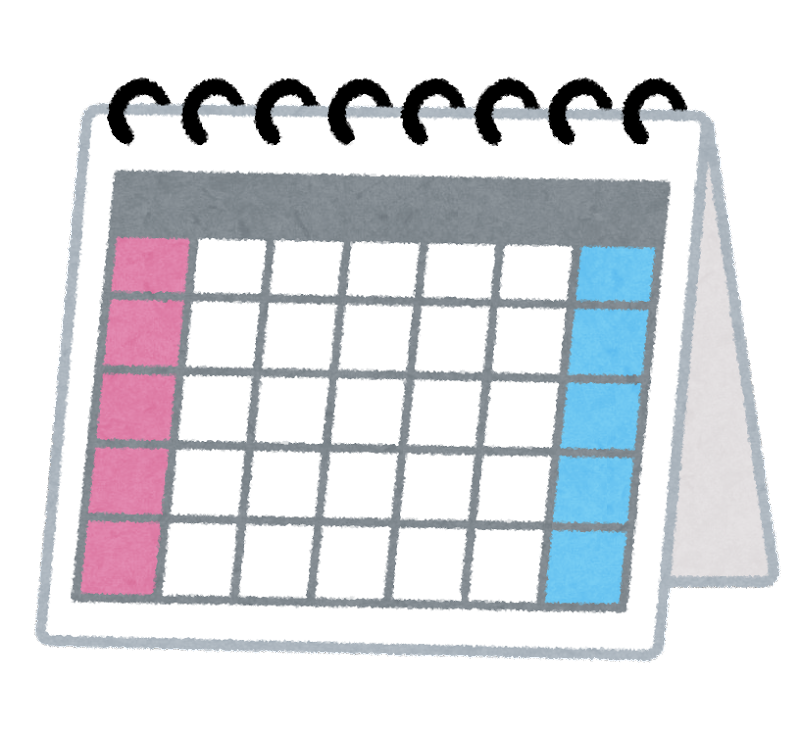
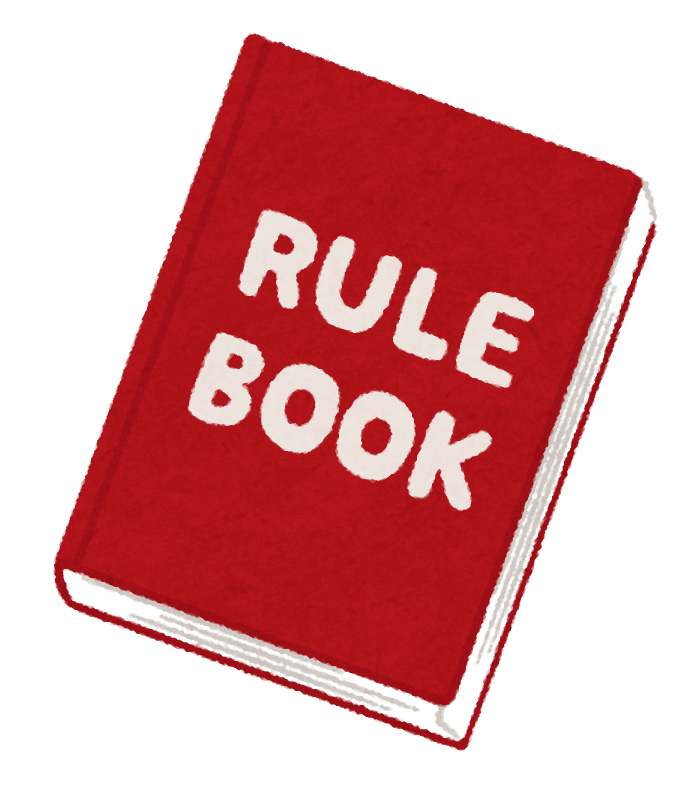

<!-- markdownlint-disable MD041 MD034 MD027 -->
<!-- cSpell:ignore aisatsu, boushi, kangaechu, kouji, nimotsu, saikoro, sekaichizu, shinnen, takujou, touhyou, yuudoubou -->

<!-- CARDFAQ:PAGE 1 /-->

<br />
<sup><em>
  <a href="https://myanimelist.net/anime/22789">Barakamon</a> banner by
  <a href="https://myanimelist.net/profile/Yes_Im_Lumzing">@Yes_Im_Lumzing</a>
</em></sup>

# The Newbie Club Card Guides and FAQ

## 💬 Introduction


**Welcome to The Newbie Club's Guideline for card request and frequently asked questions.**

This documentation will assist you on how to request cards on this club and any questions that may
frequently asked.

To begin, read contents below one-by-one.

*We encourage you to use desktop version for better experience.*


### 🌐 Translation

We also provide translation for this documentation. To read this in your language, check
[languageContent.md][i18n].

<br /><br />

## 📃 Index

<!-- cSpell:disable -->

<details><summary>See the index</summary>

* [The Newbie Club Card Guides and FAQ](#the-newbie-club-card-guides-and-faq)
  * [💬 Introduction](#-introduction)
    * [🌐 Translation](#-translation)
  * [📃 Index](#-index)
  * [🎉 Acknowledgement](#-acknowledgement)
  * [⚖️ Legal](#️-legal)
* [About: Cards](#about-cards)
  * [💳 What is card?](#-what-is-card)
  * [✉️ How to get the cards?](#️-how-to-get-the-cards)
  * [❓ What are those random text inside brackets?](#-what-are-those-random-text-inside-brackets)
  * [🤔 Can I remove some "questions" on the forms?](#-can-i-remove-some-questions-on-the-forms)
  * [↩️ Can I get cards from previous edition?](#️-can-i-get-cards-from-previous-edition)
  * [🉑 Do I still have a chance to get cards if I sent request after request limit and/or after deadline?](#-do-i-still-have-a-chance-to-get-cards-if-i-sent-request-after-request-limit-andor-after-deadline)
* [About: Limit](#about-limit)
  * [🛑 What is card limit?](#-what-is-card-limit)
  * [⛔ What is request limit?](#-what-is-request-limit)
  * [🆙 Why is the card limit for staff greater than regular member?](#-why-is-the-card-limit-for-staff-greater-than-regular-member)
* [About: Scheduling and Edition Theme](#about-scheduling-and-edition-theme)
  * [🗓️ When is usually an edition released?](#️-when-is-usually-an-edition-released)
  * [⌚ How long the period for each edition release?](#-how-long-the-period-for-each-edition-release)
  * [🎨 Which theme The Newbie Club usually release for the card edition?](#-which-theme-the-newbie-club-usually-release-for-the-card-edition)
* [About: Rules Enforcement](#about-rules-enforcement)
  * [📕 What rules for requesting the cards, can you explain it?](#-what-rules-for-requesting-the-cards-can-you-explain-it)
  * [⚠️ Why one of the staff sent me a warning to my PM?](#️-why-one-of-the-staff-sent-me-a-warning-to-my-pm)
  * [🚶‍♂️ I saw someone *bypassed* the limit by adding plus (+), what is it?](#️-i-saw-someone-bypassed-the-limit-by-adding-plus--what-is-it)
  * [🕵️‍♂️ I have issue with one or more cards, where I can speak to?](#️️-i-have-issue-with-one-or-more-cards-where-i-can-speak-to)
  * [🙅‍♂️ My content was being used without permission, where I can submit takedown request?](#️-my-content-was-being-used-without-permission-where-i-can-submit-takedown-request)
* [About: Delivery and Usage](#about-delivery-and-usage)
  * [🚛 When I can get my cards?](#-when-i-can-get-my-cards)
  * [😢 What do I do when I didn't receive the card?](#-what-do-i-do-when-i-didnt-receive-the-card)
  * [🖼 Where can I put the cards?](#-where-can-i-put-the-cards)
* [About: Signature Shortcut](#about-signature-shortcut)
  * [🔗 Can I ask the deliverer to lookup delivery link on my forum signature?](#-can-i-ask-the-deliverer-to-lookup-delivery-link-on-my-forum-signature)
  * [📜 Is there any guideline for it?](#-is-there-any-guideline-for-it)
* [About: Suggestion](#about-suggestion)
  * [🗳️ What is edition suggestion?](#️-what-is-edition-suggestion)
  * [✍ Which one I can suggest to the team?](#-which-one-i-can-suggest-to-the-team)
  * [🙋‍♂️ Can I suggest more than one titles/subject in one reply/request?](#️-can-i-suggest-more-than-one-titlessubject-in-one-replyrequest)
  * [🕔 How long will suggested edition take to be released?](#-how-long-will-suggested-edition-take-to-be-released)
* [About: Miscellaneous](#about-miscellaneous)
  * [Production](#production)
    * [🖌️ How do your team create the card?](#️-how-do-your-team-create-the-card)
    * [🔎 Can I know the technical information to create card?](#-can-i-know-the-technical-information-to-create-card)
    * [🤖 Writing one-by-one requester's names seems very tedious, isn't there any automation to do it?](#-writing-one-by-one-requesters-names-seems-very-tedious-isnt-there-any-automation-to-do-it)
  * [Staff](#staff)
    * [👥 How I can join as Designer or Card Deliverer?](#-how-i-can-join-as-designer-or-card-deliverer)
    * [🎖 I saw an ex-staff got their personalized card for their contribution, can I apply to get it?](#-i-saw-an-ex-staff-got-their-personalized-card-for-their-contribution-can-i-apply-to-get-it)
  * [Slip card](#slip-card)
    * [➕ What is slip card?](#-what-is-slip-card)
    * [📬 How to get slip card?](#-how-to-get-slip-card)
* [Footnotes](#footnotes)

</details>

<!-- cSpell:enable -->

## 🎉 Acknowledgement


Thanks to these awesome people to help us writing this documentation. They are the best!

* [Allegedshrimp](https://myanimelist.net/profile/Allegedshrimp) - FAQ Provider
* [Cliptsu](https://myanimelist.net/profile/Cliptsu) - Proofread
* [Karasian](https://myanimelist.net/profile/Karasian) - The Newbie Club Owner
* [kunminer123](https://myanimelist.net/profile/kunminer123) - FAQ Provider
* [Sp3ctr](https://myanimelist.net/profile/Sp3ctr) - Quality Check &amp; FAQ Provider
* [Yes_Im_Lumzing](https://myanimelist.net/profile/Yes_Im_Lumzing) - Proofread

## ⚖️ Legal


The key words `MUST`, `MUST NOT`, `REQUIRED`, `SHALL`, `SHALL NOT`, `SHOULD`, `SHOULD NOT`,
`RECOMMENDED`, `MAY`, and `OPTIONAL` in this documentation are to be interpreted as described in
RFC 2119.<sup><a href="#fn1">1</a></sup>

This documentation is published under [Creative Commons Attribution (BY) 4.0][CCBY40] license.

Clip arts on this documentation are copyrighted materials used under non-commercial purpose.

<!-- START: DO NOT TRANSLATE THIS COPYRIGHT NOTICE -->
**COPYRIGHT © 2021 Irasutoya. All Rights Reserved.**\
**© 2021 いらすとや/みふねたかし**

Homepage/ホームページ: https://irasutoya.com
<!-- END: TRANSLATION RESTRICTION -->

----------------------------------------------------------------------------------------------------

<!-- CARDFAQ:PAGE 2 /-->


# About: Cards

## 💳 What is card?


**Cards** or **card editions** are a club thing that don’t serve a real purpose, but are rather
collectibles that you can, for example, just save, show off in a blog post on MAL such as in this
example here, or display them in your MAL profile, your forum signature,
etc.<sup><a href="#fn2">2</a></sup>

We don't have a definite answer on how it became a thing but it's in a lot of other clubs as well.
This is just one of them.

Members collect them for these reasons:

1. Show off in a blog.
2. The sake of having a collection.
3. Admire the cards made by different designers.

The card design you will get is same as what you requested with your username in
it.<sup><a href="#fn3">3</a></sup>

## ✉️ How to get the cards?
<!-- markdownlint-disable MD032 -->
Requesting an card is easy by following this step:


* **Check if the edition still open.**
  > You can check it by looking up thread title. If it says `[CLOSED]` or `[HALTED]`, then you're
  > out of luck. ;-;
* **Read carefully the instruction and rules included on the edition.**
  > These instructions will assist you on how to request the cards while abiding rules.
1. Copy the form provided on the edition thread.
   > In some cases, user required to **not modify** the template at all.
2. Go to the bottom/top of thread, and look for "Post New Reply" or "Quick Reply" button/link, and
   click it to reply.
3. Paste the form to the text box, and fill the form based what the instruction suggests.
   > Make sure total amount cards you requested for each staff is not exceeded from limit specified.
4. Submit the request.
5. You're done!

<!-- markdownlint-enable MD032 -->

## ❓ What are those random text inside brackets?

Those are known as BBCode tags. Simply saying, those are instructions to tell MyAnimeList which text
we want to format.

For example, if we want to make the text **bold**, we can do it by typing:

```css
[b]bold[/b]
```

You can learn more about BBCode from:

* [The Newbie Club BBCode Guide][tncBBCode]
* [MyAnimeList's Official Formatting Tips][malBBCode]
* [Shishio's BBCode Guide (with Video)][shishioBBCode]

## 🤔 Can I remove some "questions" on the forms?


Short answer, **no**.

All of those questions, excluding comments, suggestion, and feedback (if any),
are required in request form.

In The Newbie Club, the structure must stay as if, due to implementation on bot.

However, you can leave it blank as to avoid any conflict.

## ↩️ Can I get cards from previous edition?

**No**. It is not possible to get previous edition's cards, UNLESS if there's ongoing re-run event.

However, the designing staff might reuse/carry the design language from previous edition they
participated.

## 🉑 Do I still have a chance to get cards if I sent request after request limit and/or after deadline?

**No**. Your request will be considered invalid.

----------------------------------------------------------------------------------------------------

<!-- CARDFAQ:PAGE 3 /-->


# About: Limit

## 🛑 What is card limit?

<!-- markdownlint-disable MD022 MD024 -->

A card limit is the maximum amount of cards a member can order/request from a particular designing
staff OR edition.

In default, The Newbie Club card limit is set to staff. But in some case, the limit is set
globally (applied to the edition).<sup><a href="#fn4">4</a></sup>

You can see the limit specified by staff under their name, usually written as:
> ## Samantha
> **Member:** `x`/`y`\
> **Staff:** `x`/`y`

Or

> ## Nicolas
> **Any:** `x`/`y`

With `x` is amount of cards you can take, and `y` is total amount of card available.

<!-- markdownlint-enable MD022 MD024 -->

## ⛔ What is request limit?


Request limit is the maximum amount of replies/requests in an edition.

It is usually set to 100 requests per edition.

Please note that due to how MyAnimeList count replies, you can calculate by subtracting replies with
main/first post instead, and another 2<sup>nd</sup> post by poster, if any.

## 🆙 Why is the card limit for staff greater than regular member?

In short: they *work* for club, so it is absolutely understandable if they would like more cards
compared to regular members.

----------------------------------------------------------------------------------------------------

<!-- CARDFAQ:PAGE 4 /-->



# About: Scheduling and Edition Theme

## 🗓️ When is usually an edition released?

We usually release the edition bi-weekly every 1st and 3rd week of the month in Sunday at 8:00 AM or
11:00 AM UTC/GMT+0.

However, we might not release for a week or even a month as to provide free time during
holiday/vacation period.

## ⌚ How long the period for each edition release?

It is 5 days, counted from second of edition released and ended on Thursday, UNLESS under some
circumstance.

## 🎨 Which theme The Newbie Club usually release for the card edition?

Due to club's nature, we are focusing in introducing animanga and Japanese culture to any newcomers.

----------------------------------------------------------------------------------------------------

<!-- CARDFAQ:PAGE 5 /-->



# About: Rules Enforcement

## 📕 What rules for requesting the cards, can you explain it?

In TNC, we have rules for both regular members and club staff to acknowledge and obey before
requesting the cards.

Below are the rules of each edition and their definition (if required):

<!-- START: DO NOT TRANSLATE CLAUSES. ONLY DESCRIPTION ALLOWED, FEEL FREE TO ADD EXPLANATIONS -->

> 1. Request your cards by <u>commenting on this forum thread</u> and using a list number instead of
>    naming the card.
>    > This clause is self explanatory.
>    >
>    > However, for "using a list number instead of naming the card," we saw some members named the
>    > card by featured figure on that card. This can result in ambiguity by bot, and the bot will
>    > ignore this as it assumes as comment.
> 2. Do not request cards if you have no intention of saving them AND/OR request for someone else.
>    > This clause is self explanatory.
> 3. Please **follow the format and respect the limits given by each card maker**, or the request
>    will be deleted.
>    > Limit stated on this clause is [card limit](#-what-is-card-limit).
> 4. Due to our current automation limitation, **do not change or remove query names**. We will warn
>    you if find any infringement.
>    > In short, anything inside request template can not be deleted or modified. This behavior will
>    > affect our bot when fetching/taking data from forum thread to database.
> 5. If you want to claim additional card(s) using slip card AND/OR by requirement from designer,
>    please use plus symbol (+) on additional card(s).
>    > See [Slip Card](#slip-card).
> 6. In cases where your username is long and ensure your name fits, it's advised to **leave a short
>    name/nickname no more than 12 characters/words**.
>    > Most of card designs have limited space for text field, usually only available around 12
>    > characters.
> 7. **Editions are limited to** *`x`* **requests**, so it's first come, first served!
>    > This clause is self explanatory.

<!-- END: TRANSLATION RESTRICTION -->


## ⚠️ Why one of the staff sent me a warning to my PM?

We found an error on your request and/or did not obey the rules stated on the edition.

Your request were either edited to comply bot configuration by us OR deleted if there is exceeded
amount of card request on particular staff.

## 🚶‍♂️ I saw someone *bypassed* the limit by adding plus (+), what is it?

They used slip card on their request. To learn more, see [Slip Card](#slip-card).

## 🕵️‍♂️ I have issue with one or more cards, where I can speak to?

Please send a MAL PM to [@nattadasu][nattadasu] for further investigation.

## 🙅‍♂️ My content was being used without permission, where I can submit takedown request?

Please send a takedown request to [dmca@nattadasu.my.id][mailTo]. We will try our best in taking
down in day or earlier.

Unfortunately due to the club does not have its dedicated email address for moment.

----------------------------------------------------------------------------------------------------

<!-- CARDFAQ:PAGE 6 /-->


# About: Delivery and Usage

## 🚛 When I can get my cards?

Usually designer required a week or more to finish all of request, upload the files, and distribute
the cards one-by-one to each requesters.

It is indeed taking a lot of time for designer to do it by theirselves, so we facilitated by adding
new subsection: card deliverer.

However, in some case, designer unable to finish it in a week and probably will take months to
finish due to works they need to finish first.

Keep in note that most of our club staff are teenagers and undergrad students, and we focus more
in our education.

## 😢 What do I do when I didn't receive the card?

Before filing a complaint, please check [Card Delivery Tracking][cardTrack] thread and read
instructions stated on the thread.

By it status:

* If the status of designer is 🎨 **designing**, and it is **less than 2 months** after thread
  closed:
  > Please wait.
* If the status of designer is 🎨 **designing**, and it is **more than or equal to 2 months** after
  thread closed:
  > Send a MAL PM to [@nattadasu][nattadasu].
* If the status of designer is ✅ **delivered**, but did not received the card:
  > Send a MAL PM to respective designer.
* If the status of designer is ❌ **halted**:
  > Send a MAL PM to [@nattadasu][nattadasu].

## 🖼 Where can I put the cards?

As we stated earlier on [💳 What is card](#-what-is-card), you can put it whereever you want!

You can put it on your MAL Blog, Profile Bio, or even created separated website just for album.

----------------------------------------------------------------------------------------------------

<!-- CARDFAQ:PAGE 7 /-->


# About: Signature Shortcut

## 🔗 Can I ask the deliverer to lookup delivery link on my forum signature?

**Yes**, you can! But we still recommend you to at least hyperlink "LIS"/"Blog Post" to your
respective delivery blog instead.

## 📜 Is there any guideline for it?

We do have guides for it, but most likely it is a common sense or give the designer/deliverer more
accessibility.

If you interested to know more, read the guide below:

* Link should be on the left side of signature content.
* If link to blog was hyperlinked into signature image:
  * If you have multiple hyperlinked images, you **must explicitly state** which one is the correct
   link by adding text into the image itself OR you can state the location of the link on comment
   query.
  * If you only have one image, you are not required to state the location.
* Link to blog that hyperlinked into text **must**:
  * Visible by any background, white and dark.
    > Lightness of the color must not below 25% and above 90%.
  * Avoid font size below 40% of MyAnimeList's 13px.
  * Avoid any *fancy* font style to ensure Unicode compability on designer/deliverer end machine.

----------------------------------------------------------------------------------------------------

<!-- CARDFAQ:PAGE 8 /-->


# About: Suggestion

## 🗳️ What is edition suggestion?

Edition suggestion is suggestion to helps us which topic will be released next.

The suggestion field is open for everyone, including staff, and each of them are able to suggest one
topic/title per submission.

## ✍ Which one I can suggest to the team?


We accept anything!<a href="fn5"><sup>5</sup></a>

You can suggest us **one** of your favorite anime/manga title, director, voice actors, event, or
even general topic. <!-- pun unintended, ngl. -->

Please note that the chances we picked specific director's/VA's works is very low, as we are more
embracing in introducing animanga and Japanese culture to newcomers.

## 🙋‍♂️ Can I suggest more than one titles/subject in one reply/request?

Unfortunately, **no**. We want to be fair as possible and considering of this club's main purpose,
this is our approach for it.

## 🕔 How long will suggested edition take to be released?

Imagine like a *demand rate theory*, the more people want it (demand), the less time will take
for the edition to be released, thus the rate is greater.

Due to how we implement the system, it is a little bit different.

In TNC, there are three steps before the edition release, and it is happening after second edition
released to public:

1. Requesters suggested the editions up to minimum threshold.
   > Minimum threshold may vary by the general topic and/or audience of the suggestion is.
   >
   > If the suggested topic is about recurrence event, threshold will be skipped, and automatically
   > jumps to the second steps.
2. When the threshold is reached, it will be listed as an option for the inner team tally. As the
   club will hold 2 editions in every month, options in each tally is 4 up to 6.
3. Any staff of graphic designing and delivery team, deputies of each section, and admin of each
   section will decide which edition will be released. The most votes will be released on first
   week.
   > Also, staff might will not vote the suggestion even if the edition itself was suggested for
   > double or more times than minimum threshold.

As our suggestion list is growing faster, unfortunately it will take 5 months to a year if demand
rate is 0.5/month.<a href="#fn6"><sup>5</sup></a>

We want those suggestions were released completely, but considering the main purpose of the club
exist, it can't be helped. You might want to suggest your specific edition suggestion to another
club with their main purpose is collecting collectibles.

----------------------------------------------------------------------------------------------------

<!-- CARDFAQ:PAGE 9 /-->


# About: Miscellaneous

## Production


### 🖌️ How do your team create the card?

We use Adobe Photoshop for our work, but it's not the requirement.

We allow staff to use other apps than Photoshop, like Affinity Designer, Krita, GIMP, Paint.NET,
ibisPaint, etc.

*Heck*, the GFX head himself <!--, @nattadasu, --> uses Microsoft Office PowerPoint to design his
cards, and barely no one noticed it.

### 🔎 Can I know the technical information to create card?

Sure!

We use this configuration for our cards:

* Allowed file format for card: PNG, A-PNG (Animated PNG), GIF, and JPEG. However, PNG is
  recommended.
* Ratio (orientation) can be landscape, portrait, or square (1:1).
* Resolution/size for card can not exceed, based on orientation:
  * Landscape: 360x240px (3:2).
  * Portrait: 240x360px (2:3).
  * Square: 240x240px (1:1).
    > **Note:**\
    > Create your card with twice of resolution on your draft, and then rescale it back. This
    > method is to avoid any visual lost after you created it.
* Recommended to use 300dpi, minimum 90dpi.
* Card should *at least* contains 3 (three) text fields/spaces:
  1. **Edition name**, e.g: "School Edition."
  2. **Club Name**, e.g: "The Newbie Club" or "TNC."
  3. **Username/Nickname**, This will be where we write the names of people who requested cards
     from the edition before delivering them.

If you want to learn more, visit [The Newbie Club's GFX Encyclopedia][encyclopedia].


### 🤖 Writing one-by-one requester's names seems very tedious, isn't there any automation to do it?

As you expect, **yes**, there is an automation method to ease the progress in creating cards.

However, this method is currently limited to Adobe Photoshop. We can't find any automation feature
or script for another program.

If you want to learn more, visit [The Newbie Club's GFX Encyclopedia][encyclopedia].

## Staff


### 👥 How I can join as Designer or Card Deliverer?

Thanks for your interest!

If you want to join to our team, please head out to [Application Thread][staffRecruitment].

### 🎖 I saw an ex-staff got their personalized card for their contribution, can I apply to get it?

**Yes**, you can!

However, we have some requirements that need to be fullfilled by the ex-staff before getting the
honor card:

1. User must contributed as TNC Staff in any sections for at least 6 months or older.
   > If the staff was an admin or deputy of each section, this clause skipped.
2. User must joined to staff-only Discord server (S.S Remaining) during contribution, and having at
   least 1 message sent to one of the channel.
3. Both Discord and MAL accounts must active/not deleted during and after the contribution.

To apply, please send a MAL PM to [@nattadasu][nattadasu] with a title "Honor Card Application" and
attach the requirements stated below:

1. Your current MAL Username and former (if any).
2. Your current Discord Username and former (if any).
3. Your Discord User ID.
   > To get your User ID, please follow instruction [**here**][discEncyclopediaUserID].
4. Your former contributed section.

## Slip card

### ➕ What is slip card?


A slip card is a card that allows requesters to bypass the limit with specified amount on the card
itself. Basically the slip card is like loyalty/membership cards applied on stores.

The reason why it exist is unclear, but by looking the pattern of usage, it become clear:

1. The requester is regular *customer*.
2. The requester adores the design made by particular staff.
3. They just likes to collect cards.

On TNC, you can attach your slip card into your request by adding image inside spoiler box, and then
explicitly stating on request if they own slip card by adding addition (+) symbol to cards.

For example:

```css
[...]
Natsu: 1, 3 + 5, 7 [spoiler="slip card"][img]https://i.imgur.com/CqaSw61.png[/img][/spoiler]
```

Above code snippet will be rendered as:

> Natsu: 1, 3 + 5, 7
> <details><summary>Show slip card</summary></details>

### 📬 How to get slip card?

You can get the slip card by checking designer's profile. Club does not provide first party slip
card store, and you must check it manually.

To ease the progress, check any links given by designer/deliverer in their delivery message if they
have slip card store store.

----------------------------------------------------------------------------------------------------

<!-- CARDFAQ:PAGE 10 /-->

# Footnotes

1. <a id="fn1"></a> [Key words for use in RFCs to Indicate Requirement Levels][rfc2119]
2. <a id="fn2"></a> [The Newbie Club Discussion - FAQs][faq]
3. <a id="fn3"></a> [TY answers regarding cards][tyDiscord]
4. <a id="fn4"></a> [\[CARDS\] \[CLOSED\] 🎃 TNC X HNE Halloween Collab][tncCollab]
5. <a id="fn5"></a> It must be inside ACG (Animation, Comic, Game) and Japanese culture.
6. <a id="fn6"></a> 1 person requested that particular edition in each edition releases, and
   assuming if the threshold is 10.

<!-- LINKS -->
[cardTrack]: https://myanimelist.net/forum/?topicid=1981019
[CCBY40]: ../LICENSE
[discEncyclopediaUserID]: https://support.discord.com/hc/en-us/articles/206346498
[encyclopedia]: https://thenewbieclub-mal.github.io/gfxEncyclopedia
[faq]: https://myanimelist.net/forum/?topicid=1779538
[i18n]: languageContent.md
[mailTo]: mailto:dmca@nattadasu.my.id?subject=The%20Newbie%20Club%3A%20Takedown%20Request
[malBBCode]: https://myanimelist.net/info.php?go=bbcode
[nattadasu]: https://myanimelist.net/profile/nattadasu
[rfc2119]: https://datatracker.ietf.org/doc/html/rfc2119
[shishioBBCode]: https://myanimelist.net/forum/?topicid=496203
[staffRecruitment]: https://myanimelist.net/forum/?topicid=1711795
[tncBBCode]: https://myanimelist.net/forum/?topicid=1844723
[tncCollab]: https://myanimelist.net/forum/?topicid=1967957
[tyDiscord]: https://discord.com/channels/449172244724449290/534122024860123182/546412983417307154