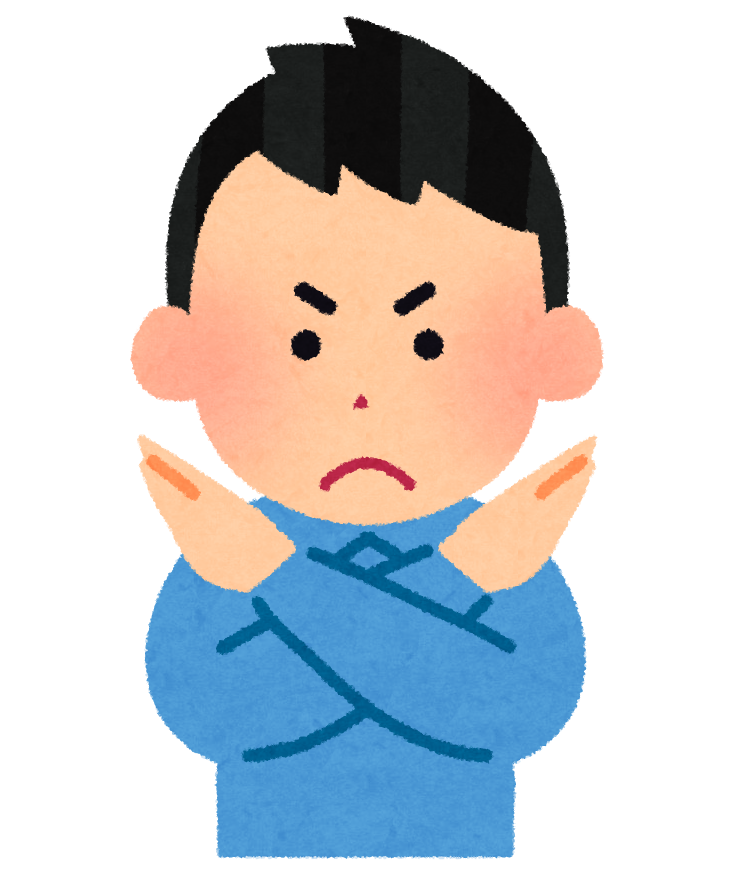

<!-- markdownlint-disable MD041 MD034 -->

<p align="center">
  <br/>
  <sup><em>
    <a href="https://myanimelist.net/anime/22789">Barakamon</a> banner by
    <a href="https://myanimelist.net/profile/Yes_Im_Lumzing">@Yes_Im_Lumzing</a>
  </em></sup>
</p>

# The Newbie Club Card Guides and FAQ

## 💬 Introduction


**Welcome to The Newbie Club's Guideline for card request and frequently asked questions.**

This documentation will assist you on how to request card(s) on this club and any questions that may
frequently asked about.

To begin, read contents below one-by-one.

*We encourage you to use desktop version for better experience.*


### 🌐 Translation

We also provide translation for this documentation. To read this in your language, check
[languageContent.md](languageContent.md).

<br/><br/>

## 📃 Index

* [The Newbie Club Card Guides and FAQ](#the-newbie-club-card-guides-and-faq)
  * [💬 Introduction](#-introduction)
    * [🌐 Translation](#-translation)
  * [📃 Index](#-index)
  * [🎉 Acknowledgement](#-acknowledgement)
  * [⚖️ Legal](#️-legal)
* [About: Cards](#about-cards)
  * [💳 What is card?](#-what-is-card)
  * [✉️ How to get the cards?](#️-how-to-get-the-cards)
  * [❓ What are those random text inside brackets?](#-what-are-those-random-text-inside-brackets)
  * [🤔 Can I remove some "questions" on the forms?](#-can-i-remove-some-questions-on-the-forms)
  * [1️⃣ What is slip card?](#1️⃣-what-is-slip-card)
  * [👣 Footnotes](#-footnotes)

## 🎉 Acknowledgement


Thanks to these awesome people to help us writing this documentation. They are the best!

* [Allegedshrimp](https://myanimelist.net/profile/Allegedshrimp) - FAQ Provider
* [Karasian](https://myanimelist.net/profile/Karasian) - The Newbie Club Owner
* [kunminer123](https://myanimelist.net/profile/kunminer123) - FAQ Provider

## ⚖️ Legal


This documentation is published under [Creative Commons Attribution (BY) 4.0][CCBY40] license.

Clip arts on this documentation are copyrighted materials used under non-commercial purpose.

<!-- START: DO NOT TRANSLATE THIS COPYRIGHT NOTICE -->
**COPYRIGHT © 2021 Irasutoya. All Rights Reserved.**\
**© 2021 いらすとや/みふねたかし**

Homepage/ホームページ: https://irasutoya.com
<!-- END: TRANSLATION RESTRICTION -->

<!-- Links -->
[banner]: ../assets/banner/banner.png
[CCBY40]: ../LICENSE
[a22789]: https://myanimelist.net/anime/22789
[bannerAttribution]: https://myanimelist.net/profile/Yes_Im_Lumzing

<hr/>


# About: Cards

## 💳 What is card?

**Cards** or **card editions** are a club thing that don’t serve a real purpose, but are rather
collectibles that you can, for example, just save, show off in a blog post on MAL such as in this
example here, or display them in your MAL profile, your forum signature, etc.<sup><a href="#fn1">1</a></sup>

We don't have a definite answer on how it became a thing but it's in a lot of other clubs as well.
This is just one of them.


Graphic designers use programs such as Adobe Photoshop, Krita, GIMP, and Paint.NET (or any editing
program<!-- including Microsoft PowerPoint :o-->) to make cards.

Members collect them for these vary reasons:

1. Show off in a blog.
2. The sake of having a collection.
3. Admire the cards made by different designers.

The card design you will get is same as what you requested with your username in
it.<sup><a href="#fn2">2</a></sup>

## ✉️ How to get the cards?
<!-- markdownlint-disable MD032 -->
Requesting an card is easy by following this step:


* Check if the edition still open.
  > You can check it by looking up thread title. If it says `[CLOSED]` or `[HALTED]`, then you're
  > out of luck. ;-;
* Read carefully the instruction and rules included on the edition.
  > These instructions will assist you on how to request the cards while abiding rules.
1. Copy the form provided on the edition thread.
   > In some cases, user required to **not modify** the template at all.
2. Go to the bottom/top of thread, and look for "Post New Reply"/"Quick Reply" button/link, and
   click that button/link to reply.
3. Paste the form to the text box, and fill the form based what the instruction suggests.
   * Make sure total amount cards you requested for each staff is not exceeded from limit specified.
4. Submit the request.
5. You're done!

<!-- markdownlint-enable MD032 -->

## ❓ What are those random text inside brackets?

Those are known as BBCode tags. Simply saying, those are instructions to tell MyAnimeList which text
we want to format.

For example, if we want to make the text **bold**, we can do it by typing:

```as
[b]bold[/b]
```

You can learn more about BBCode from:

* [The Newbie Club BBCode Guide](https://myanimelist.net/forum/?topicid=1844723)
* [MyAnimeList's Official Formatting Tips](https://myanimelist.net/info.php?go=bbcode)
* [Shishio's BBCode Guide (with Video)](https://myanimelist.net/forum/?topicid=496203)

## 🤔 Can I remove some "questions" on the forms?



Short answer, **no**.

All of those questions, excluding comments, suggestion, and feedback (if any),
are required in request form.

In The Newbie Club, the structure must stay as if, due to implementation on bot.

However, you can leave it blank as to avoid any *conflict*.

## 1️⃣ What is slip card?

## 👣 Footnotes

1. <a id="fn1"></a> [The Newbie Club Discussion - FAQs](https://myanimelist.net/forum/?topicid=1779538)
2. <a id="fn2"></a> [TY answers regarding cards](https://discord.com/channels/449172244724449290/534122024860123182/546412983417307154)
