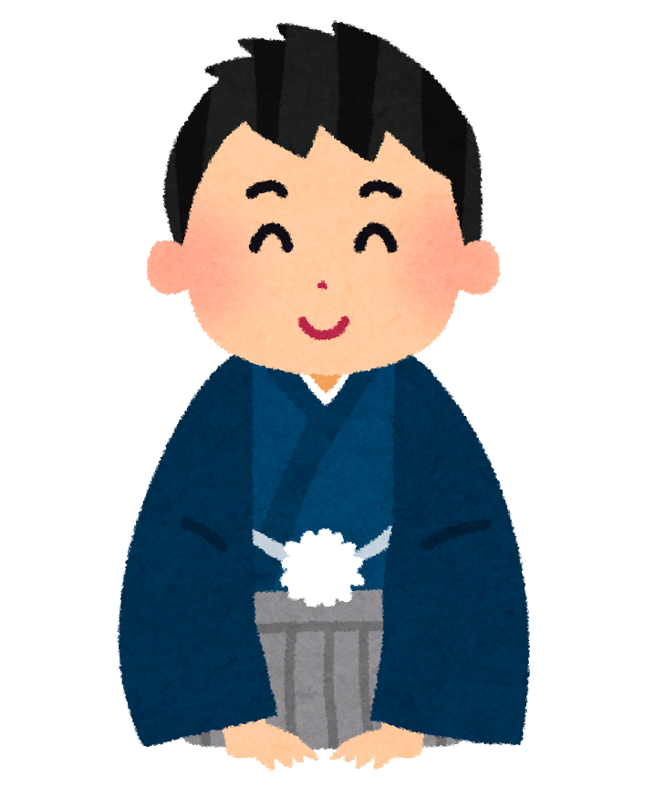
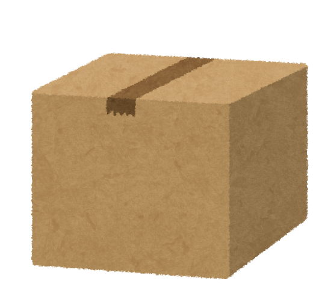
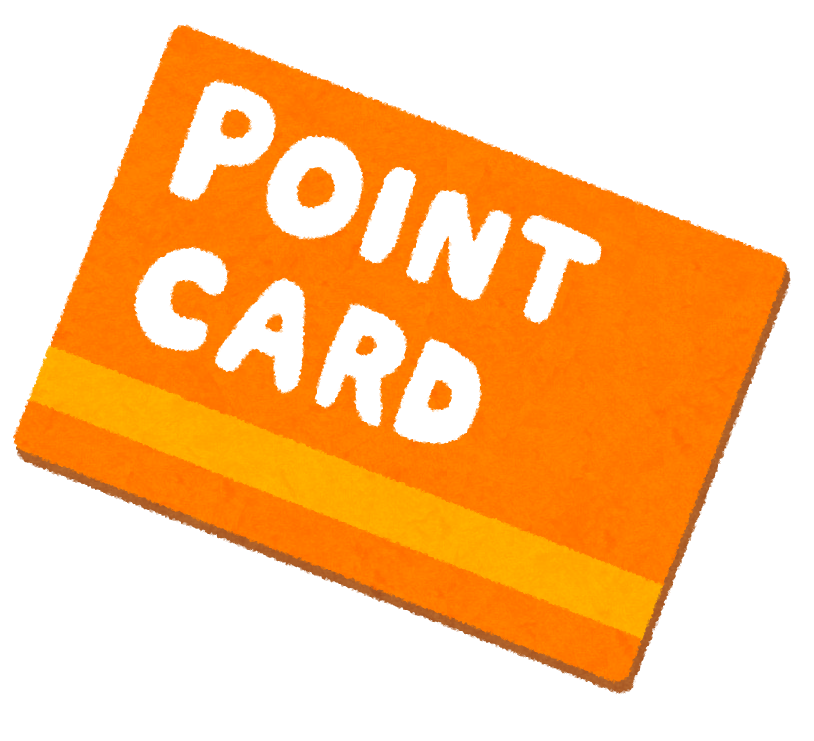

<!-- markdownlint-disable MD041 MD034 MD027 MD013 MD035 -->
<!-- cSpell:ignore aisatsu, boushi, kangaechu, kouji, nimotsu, saikoro, sekaichizu, shinnen, takujou, touhyou, yuudoubou, chuui, senkyo -->

<!-- CARDFAQ:PAGE 1 /-->

<br />
<sup><em>
  Banner <a href="https://myanimelist.net/anime/22789">Barakamon</a> oleh
  <a href="https://myanimelist.net/profile/Yes_Im_Lumzing">@Yes_Im_Lumzing</a>
</em></sup>

# Panduan dan Soalan Lazim Kad The Newbie Club

## 💬 Pengenalan


**Selamat datang ke Panduan The Newbie Club untuk permintaan kad dan soalan lazim.**

Dokumen ini akan membantu anda meminta kad di kelab ini dan bersama-sama dengan soalan yang mungkin
sering ditanya.

Untuk memulakan, sila baca kandungan di bawah satu persatu.

*Anda digalakkan menggunakan versi desktop untuk pengalaman membaca yang lebih baik.*


### 🌐 Terjemahan

Kami juga menyediakan terjemahan untuk dokumen ini. Untuk membaca ini dalam bahasa anda, lawati
[languageContent.md][i18n].

<br /><br />

## 📃 Senarai Kandungan

<!-- cSpell:disable -->

<details><summary>Lihat senarai kandungan</summary>

* [Panduan dan Soalan Lazim Kad The Newbie Club](#panduan-dan-soalan-lazim-kad-the-newbie-club)
  * [💬 Pengenalan](#-pengenalan)
    * [🌐 Terjemahan](#-terjemahan)
  * [📃 Senarai Kandungan](#-senarai-kandungan)
  * [🎉 Ucapan Terima Kasih](#-ucapan-terima-kasih)
  * [⚖️ Undang-Undang](#️-undang-undang)
* [Tentang: Kad](#tentang-kad)
  * [💳 Apakah kad itu?](#-apakah-kad-itu)
  * [✉️ Bagaimana anda mendapat kad?](#️-bagaimana-anda-mendapat-kad)
  * [❓ Apakah teks rawak dalam kurungan kotak ini?](#-apakah-teks-rawak-dalam-kurungan-kotak-ini)
  * [🤔 Boleh saya memadamkan "pertanyaan" pada borang itu?](#-boleh-saya-memadamkan-pertanyaan-pada-borang-itu)
  * [↩️ Bolehkah saya mendapatkan kad dari edisi sebelumnya?](#️-bolehkah-saya-mendapatkan-kad-dari-edisi-sebelumnya)
  * [🉑 Adakah saya masih mempunyai peluang untuk mendapatkan kad jika saya menghantar permintaan selepas limit permintaan dan/atau tarikh akhir?](#-adakah-saya-masih-mempunyai-peluang-untuk-mendapatkan-kad-jika-saya-menghantar-permintaan-selepas-limit-permintaan-danatau-tarikh-akhir)
* [Tentang: Limit](#tentang-limit)
  * [🛑 Apa itu limit kad?](#-apa-itu-limit-kad)
  * [⛔ Apa itu limit permintaan?](#-apa-itu-limit-permintaan)
  * [🆙 Kenapa limit kad untuk staf lebih besar daripada anggota?](#-kenapa-limit-kad-untuk-staf-lebih-besar-daripada-anggota)
* [Tentang: Penjadwalan dan Tema Edisi](#tentang-penjadwalan-dan-tema-edisi)
  * [🗓️ Kapan biasanya edisi dirilis?](#️-kapan-biasanya-edisi-dirilis)
  * [⌚ Berapa lama periode untuk setiap rilis edisi?](#-berapa-lama-periode-untuk-setiap-rilis-edisi)
* [🎨 Tema mana yang biasanya dirilis oleh Newbie Club untuk edisi kartu?](#-tema-mana-yang-biasanya-dirilis-oleh-newbie-club-untuk-edisi-kartu)
* [Tentang: Penegakan Peratuan](#tentang-penegakan-peratuan)
  * [📕 Peraturan apa saja untuk meminta kartu? Apa bisa dijelaskan lebih lanjut?](#-peraturan-apa-saja-untuk-meminta-kartu-apa-bisa-dijelaskan-lebih-lanjut)
  * [⚠️ Mengapa salah satu staf mengirimi saya peringatan melalui PM?](#️-mengapa-salah-satu-staf-mengirimi-saya-peringatan-melalui-pm)
  * [🚶‍♂️ Saya melihat seseorang *melewati* limit dengan menambahkan simbol tambah (+), apa itu?](#️-saya-melihat-seseorang-melewati-limit-dengan-menambahkan-simbol-tambah--apa-itu)
  * [🕵️‍♂️ Saya memiliki masalah dengan satu kartu atau lebih, kepada siapa saya dapat bertanya?](#️️-saya-memiliki-masalah-dengan-satu-kartu-atau-lebih-kepada-siapa-saya-dapat-bertanya)
  * [🙅‍♂️ Konten saya digunakan tanpa izin; Kepada siapa saya dapat mengajukan permintaan *takedown*?](#️-konten-saya-digunakan-tanpa-izin-kepada-siapa-saya-dapat-mengajukan-permintaan-takedown)
* [Tentang: Pengiriman dan Penggunaan](#tentang-pengiriman-dan-penggunaan)
  * [🚛 Kapan saya bisa mendapatkan kartu saya?](#-kapan-saya-bisa-mendapatkan-kartu-saya)
  * [😢 Apa yang harus saya lakukan ketika saya tidak menerima kartu?](#-apa-yang-harus-saya-lakukan-ketika-saya-tidak-menerima-kartu)
  * [🖼️ Dimana saya bisa meletakkan kartu?](#️-dimana-saya-bisa-meletakkan-kartu)
* [Tentang: Pintasan *Signature*](#tentang-pintasan-signature)
  * [🔗 Dapatkah saya meminta staf untuk menggunakan tautan pengiriman pada *signature* forum saya?](#-dapatkah-saya-meminta-staf-untuk-menggunakan-tautan-pengiriman-pada-signature-forum-saya)
  * [📜 Apa ada pedoman untuk hal ini?](#-apa-ada-pedoman-untuk-hal-ini)
* [Tentang: Saran](#tentang-saran)
  * [🗳️ Apa itu saran edisi?](#️-apa-itu-saran-edisi)
  * [✍ Apa saja yang bisa saya sarankan kepada tim?](#-apa-saja-yang-bisa-saya-sarankan-kepada-tim)
  * [🙋‍♂️ Bisakah saya menyarankan lebih dari satu judul/topik dalam satu permintaan?](#️-bisakah-saya-menyarankan-lebih-dari-satu-judultopik-dalam-satu-permintaan)
  * [🕔 Berapa lama edisi yang disarankan bakal dirilis?](#-berapa-lama-edisi-yang-disarankan-bakal-dirilis)
* [Tentang: Aneka Ragam](#tentang-aneka-ragam)
  * [Produksi](#produksi)
    * [🖌️ Bagaimana tim Anda membuat kartu?](#️-bagaimana-tim-anda-membuat-kartu)
    * [🔎 Bisakah saya mengetahui informasi teknis untuk membuat kartu?](#-bisakah-saya-mengetahui-informasi-teknis-untuk-membuat-kartu)
    * [🤖 Menulis nama peminta satu-per-satu terlihat sangat melelahkan; Bukannya ada otomasi agar membantu pekerjaan?](#-menulis-nama-peminta-satu-per-satu-terlihat-sangat-melelahkan-bukannya-ada-otomasi-agar-membantu-pekerjaan)
  * [Staf](#staf)
    * [👥 Bagaimana saya bisa bergabung sebagai desainer atau pengirim kartu?](#-bagaimana-saya-bisa-bergabung-sebagai-desainer-atau-pengirim-kartu)
    * [🎖️ Saya melihat mantan staf mendapatkan kartu pribadi mereka atas kontribusi mereka; Bisakah saya mendaftar untuk mendapatkannya?](#️-saya-melihat-mantan-staf-mendapatkan-kartu-pribadi-mereka-atas-kontribusi-mereka-bisakah-saya-mendaftar-untuk-mendapatkannya)
  * [Kartu slip](#kartu-slip)
    * [➕ Apa itu kartu slip?](#-apa-itu-kartu-slip)
    * [📬 Bagaimana cara mendapatkan kartu slip?](#-bagaimana-cara-mendapatkan-kartu-slip)
* [Catatan Kaki](#catatan-kaki)

</details>

<!-- cSpell:enable -->

## 🎉 Ucapan Terima Kasih



Terima kasih kepada orang-orang luar biasa ini yang membantu kami menulis dokumentasi ini. Mereka
yang terbaik!

* [Allegedshrimp](https://myanimelist.net/profile/Allegedshrimp) — FAQ Provider
* [Cliptsu](https://myanimelist.net/profile/Cliptsu) — Proofread
* [Exelero64](https://myanimelist.net/profile/Exelero64) — Proofread
* [Karasian](https://myanimelist.net/profile/Karasian) — The Newbie Club Owner
* [kunminer123](https://myanimelist.net/profile/kunminer123) — FAQ Provider
* [RockValRon](https://myanimelist.net/profile/RockValRon) — Proofread
* [Sp3ctr](https://myanimelist.net/profile/Sp3ctr) — Quality Check &amp; FAQ Provider
* [Tachi_Kun](https://myanimelist.net/profile/Tachi_Kun) — Proofread
* [Yes_Im_Lumzing](https://myanimelist.net/profile/Yes_Im_Lumzing) — Proofread

## ⚖️ Undang-Undang


Kata kunci `MESTI`, `MESTI TIDAK`, `DIPERLUKAN`, `HARUS`, `HARUS TIDAK`, `SEBAIKNYA`,
`SEBAIKNYA TIDAK`, `DISYORKAN`, `MUNGKIN`, dan `PILIHAN` dalam dokumen ini mesti ditafsirkan
seperti yang dijelaskan dalam RFC 2119.<sup><a href="#fn1">1</a></sup>

Dokumen ini diterbitkan di bawah lesen [Creative Commons Atribusi (BY) 4.0][CCBY40].

*Clip art* dalam karya ini adalah bahan berhak cipta yang digunakan di bawah tujuan bukan komersil.

<!-- START: DO NOT TRANSLATE THIS COPYRIGHT NOTICE -->
**COPYRIGHT © 2021 Irasutoya. All Rights Reserved.**\
**© 2021 いらすとや/みふねたかし**

Homepage/ホームページ: https://irasutoya.com
<!-- END: TRANSLATION RESTRICTION -->

----------------------------------------------------------------------------------------------------

<!-- CARDFAQ:PAGE 2 /-->


# Tentang: Kad

## 💳 Apakah kad itu?


**Kad** adalah sesuatu di kelab MyAnimeList yang sama sekali tidak mempunyai tujuan konkrit, tetapi
ia lebih ditujukan kepada koleksi di mana anda boleh menyimpan, mempamerkan di post blog MAL,
profile MAL anda, signature forum anda dan lain-lain.

Kami tidak tahu pasti mengapa koleksi kad adalah satu perkara sekaligus di kelab-kelab lain.

Anggota mengumpul kad untuk sebab-sebab berikut:

1. Memamerkan di blog.
2. Demi mempunyai koleksi.
3. Mengagumi kad yang yang dibuat oleh pereka yang berbeza.

Reka bentuk kad yang akan anda dapatkan adalah sama seperti yang anda minta, tetapi dengan nama
pengguna anda di dalamnya.<sup><a href="#fn3">3</a></sup>

## ✉️ Bagaimana anda mendapat kad?
<!-- markdownlint-disable MD032 -->

Meminta kad di TNC mudah dan boleh dilakukan dengan mengikuti langkah-langkah berikut:


* **Pastikan edisi masih terbuka.**
  > Anda boleh mengesahkan hanya dengan membaca Tajuk Forum edisi. Jika ia ditulis `[CLOSED]` atau
  > `[HALTED]`, maka anda tidak bernasib baik. ;-;
* **Baca arahan dan peraturan dalam thread edisi dengan berhati-hati.**
  > Arahan ini akan membantu anda meminta Kad semasa mematuhi peraturan.
1. Salin borang yang telah dilampirkan dalam thread edisi.
   > Dalam kes-kes tertentu, pengguna diminta untuk **tidak menukar** templat sama sekali.
2. Pergi ke bawah/atas thread, dan cari butang "Post New Reply" atau "Quick Reply," dan klik untuk
   membalas.
3. Tampalkan borang ke kotak teks, dan isikan borang berdasarkan apa yang digalakkan oleh arahan.
   > Pastikan jumlah kad yang anda minta daripada setiap staf tidak melebihi limit yang ditentukan.
4. Hantar permintaan.
5. Anda selesai!

<!-- markdownlint-enable MD032 -->

## ❓ Apakah teks rawak dalam kurungan kotak ini?

"Kod" yang anda lihat dikenali sebagai tag BBCode. Boleh dikatakan jika ia adalah arahan untuk
memberitahu MyAnimeList teks apa yang anda mahu format.

Sebagai contoh, jika kita mahu **menebal** teks, maka kita menaip cukup:

```css
[b]tebal[/b]
```

Kamu dapat mempelajari BBCode lebih lanjut dari:

* [Petunjuk BBCode oleh The Newbie Club][tncBBCode]
* [Tips Format Resmi MyAnimeList][malBBCode]
* [Petunjuk BBCode oleh Shishio (dengan video)][shishioBBCode]

## 🤔 Boleh saya memadamkan "pertanyaan" pada borang itu?


Singkatnya, **tidak boleh**.

Semua soalan yang terkandung dalam bentuk, kecuali komen, saranan, dan maklum balas (jika ada),
diperlukan.

Di The Newbie Club, struktur templat mesti serupa disebabkan oleh penggunaan robot.

Walau bagaimanapun, anda boleh mengosongkan soalan untuk mengelakkan masalah.

## ↩️ Bolehkah saya mendapatkan kad dari edisi sebelumnya?

**Tidak boleh**. Tidak mungkin untuk mendapatkan kad dari edisi sebelumnya, KECUALI jika terdapat
acara semula.

Walaupun begitu, staf boleh dapat menggunakan semula bahasa reka bentuk dari edisi sebelumnya.

## 🉑 Adakah saya masih mempunyai peluang untuk mendapatkan kad jika saya menghantar permintaan selepas limit permintaan dan/atau tarikh akhir?

**Tidak**. Permintaan anda akan diisytiharkan tidak sah.

----------------------------------------------------------------------------------------------------

<!-- CARDFAQ:PAGE 3 /-->


# Tentang: Limit

## 🛑 Apa itu limit kad?

<!-- markdownlint-disable MD022 MD024 -->

Limit kad adalah bilangan maksimum kad yang boleh diminta oleh anggota untuk setiap staf ATAU edisi.

Biasanya, limit kad di The Newbie Club ditetapkan setiap staf. Tetapi dalam kes-kes tertentu, limit
ditetapkan secara global (digunakan untuk satu edisi).<sup><a href="#fn4">4</a></sup>

Anda boleh melihat limit yang disediakan oleh staf di bawah nama mereka, biasanya ditulis
seperti:
> ## Samantha
> **Member:** `x`/`y`\
> **Staff:** `x`/`y`

Atau

> ## Nicolas
> **Any:** `x`/`y`

Dengan `X` adalah jumlah yang anda boleh ambil, dan `y` adalah bilangan kad yang ada.

<!-- markdownlint-enable MD022 MD024 -->

## ⛔ Apa itu limit permintaan?


Limit permintaan adalah bilangan maksimum permintaan yang boleh diterima dalam edisi.

Biasanya ditetapkan 100 permintaan/balasan setiap edisi.

Sila ingat bahawa kerana bagaimana MyAnimeList mengira balasan, anda boleh mengira dengan
mengurangkan balasan pertama dan kedua (jika ada) dari thread starter.

## 🆙 Kenapa limit kad untuk staf lebih besar daripada anggota?

Secara ringkas: Mereka *bekerja* untuk kelab, maka ini sangat mudah difahami jika mereka mahukan
lebih banyak kad daripada anggota.

----------------------------------------------------------------------------------------------------

<!-- CARDFAQ:PAGE 4 /-->


# Tentang: Penjadwalan dan Tema Edisi

## 🗓️ Kapan biasanya edisi dirilis?

Kami biasanya merilis edisi setiap dua minggu, minggu pertama dan ketiga setiap bulan pada hari
Minggu pukul 8.00 hingga 11.00 UTC/GMT+0 (15.00 - 18.00 WIB).

Terkadang, kami bisa saja tidak merilis edisi untuk sepekan atau bahkan hingga sebulan untuk
memberikan waktu luang saat hari libur.

## ⌚ Berapa lama periode untuk setiap rilis edisi?

Yakni 5 hari, hitungan dimulai seketika setelah edisi dipublikasi dan berakhir di hari Kamis,
TERKECUALI di bawah beberapa keadaan.

# 🎨 Tema mana yang biasanya dirilis oleh Newbie Club untuk edisi kartu?

Dikarenakan alasan utama dari klub, kami memokuskan dalam mengenalkan budaya animanga dan Jepang ke
pendatang baru.

----------------------------------------------------------------------------------------------------

<!-- CARDFAQ:PAGE 5 /-->


# Tentang: Penegakan Peratuan

## 📕 Peraturan apa saja untuk meminta kartu? Apa bisa dijelaskan lebih lanjut?

Di TNC, kami memiliki peraturan untuk anggota reguler dan staf klub yang diharapkan dapat mematuhi
sebelum meminta kartu.

Berikut adalah peraturan, terjemahan, beserta penjelasan lebih lanjut:

<!-- START: DO NOT TRANSLATE CLAUSES. ONLY DESCRIPTION ALLOWED, FEEL FREE TO ADD EXPLANATIONS -->

1. Request your cards by <u>commenting on this forum thread</u> and using a list number instead of
   naming the card.
   > **Terjemahan:**\
   > Minta kartu Anda dengan mengomentar di thread forum ini dan menggunakan nomor daftar
   > ketimbang menamai kartunya.
   >
   > ***********************************************************************************************
   >
   > Ayat ini cukup jelas.
   >
   > Namun, untuk "menggunakan nomor daftar ketimbang menamai kartunya," Kami memerhatikan beberapa
   > anggota menamai kartu oleh tokoh dalam kartu itu. Ini dapat mengakibatkan ambiguitas dengan
   > bot, dan bot akan mengabaikan itu karena dianggap sebagai komentar.
2. Do not request cards if you have no intention of saving them AND/OR request for someone else.
   > **Terjemahan:**\
   > Dilarang meminta kartu jika kamu tidak memiliki keinginan untuk menyimpannya DAN/ATAU meminta
   > untuk orang lain.
   >
   > ***********************************************************************************************
   >
   > Ayat ini cukup jelas.
3. Please **follow the format and respect the limits given by each card maker**, or the request
   will be deleted.
   > **Terjemahan:**\
   > Dimohon untuk **mengikuti format templat dan menghargai limit yang diberikan dari setiap
   > pembuat kartu**, atau permintaan akan dihapus.
   >
   > ***********************************************************************************************
   >
   > Limit yang dinyatakan dalam ayat ini ialah mengenai [limit kartu](#-apa-itu-limit-kartu).
4. Due to our current automation limitation, **do not change or remove query names**. We will warn
   you if find any infringement.
   > **Terjemahan:**\
   > Dikarenakan limitasi pada sistem otomasi kami, **dilarang keras untuk mengubah atau menghapus
   > nama kueri**. Kami akan memperingatkan Anda jika ditemukan pelanggaran.
   >
   > ***********************************************************************************************
   >
   > Secara singkat, apapun yang terdapat di templat permintaan tidak dapat dihapus ataupun
   > dimodifikasi. Hal ini dapat mempengaruhi bot kami pada saat pengambilan data dari *threa* forum
   > ke pangkalan data.
5. If you want to claim additional card(s) using slip card AND/OR by requirement from designer,
   please use plus symbol (+) on additional card(s).
   > **Terjemahan:**\
   > Jika Anda ingin mengeklaim kartu tambahan menggunakan kartu slip DAN/ATAU persyaratan dari
   > desainer, silakan gunakan simbol tambah (+) pada kartu tambahan.
   >
   > ***********************************************************************************************
   >
   > Lihat [Kartu Slip](#kartu-slip).
6. In cases where your username is long and ensure your name fits, it's advised to **leave a short
   name/nickname no more than 12 characters/words**.
   > **Terjemahan:**\
   > Dalam kasus di mana nama pengguna Anda panjang dan memastikan apabila muat, disarankan untuk
   > menggunakan nama panggilan (*nickname*) tidak lebih dari 12 karaker/huruf.
   >
   > ***********************************************************************************************
   >
   > Kebanyakan desain kartu memiliki ruang yang terbatas, biasanya hanya memuat 12 karakter.
7. **Editions are limited to** *`x`* **requests**, so it's first come, first served!
   > **Terjemahan:**\
   > **Edisi hanya dapat memampung hingga** *`x`* **permintaan**, siapa cepat, dia dapat.
   >
   > ***********************************************************************************************
   >
   > Ayat ini cukup jelas.

<!-- END: TRANSLATION RESTRICTION -->


## ⚠️ Mengapa salah satu staf mengirimi saya peringatan melalui PM?

Kami menemukan kesalahan pada permintaan kamu dan/atau tidak mematuhi peraturan yang tertera di
edisi.

Permintaan kamu mungkin saja sudah disunting oleh kami untuk bot dapat mengerti ATAU dihapus karena
kartu yang diminta melebihi limit yang diberikan dari staf.

## 🚶‍♂️ Saya melihat seseorang *melewati* limit dengan menambahkan simbol tambah (+), apa itu?

Mereka menggunakan kartu slip di permintaan mereka. Lihat [Kartu Slip](#kartu-slip) untuk
mempelajari lebih lanjut.

## 🕵️‍♂️ Saya memiliki masalah dengan satu kartu atau lebih, kepada siapa saya dapat bertanya?

Silakan kirimkan PM MAL ke [@nattadasu][nattadasu] untuk investigasi lebih lanjut.

## 🙅‍♂️ Konten saya digunakan tanpa izin; Kepada siapa saya dapat mengajukan permintaan *takedown*?

Silakan ajukan permintaan *takedown* ke [dmca@nattadasu.my.id][mailTo]. Kami akan berusaha sebaik
mungkin untuk menyelesaikan perkara dalam sehari.

Sayangnya, klub tidak memiliki alamat surel terkhusus untuk sementara waktu.

----------------------------------------------------------------------------------------------------

<!-- CARDFAQ:PAGE 6 /-->



# Tentang: Pengiriman dan Penggunaan

## 🚛 Kapan saya bisa mendapatkan kartu saya?

Biasanya desainer memerlukan waktu seminggu atau lebih untuk menyelesaikan semua permintaan,
mengunggah berkas, dan mengirimkan kartu satu-per-satu ke setiap peminta.

Karena hal ini memakan waktu yang sangat banyak untuk desainer menyelesaikan satu pekerjaan, kami
sudah memfasilitasi dengan membuat baru subseksi: *card deliverer* (pengirim kartu).

Akan tetapi, dalam kasus tertentu, desainer tidak dapat menyelesaikan pekerjaan dalam seminggu, dan
mungkin dapat menghabiskan berbulan-bulan dikarenakan hal yang mereka perlu kerjakan terlebih
dahulu.

Harap diingat bahwa kebanyakan dari staf klub kami ialah remaja dan mahasiswa sarjana, dan kami
memprioritaskan pendidikan kami.

## 😢 Apa yang harus saya lakukan ketika saya tidak menerima kartu?

Sebelum mengajukan keluhan, silakan periksa thread [Card Delivery Tracking][cardTrack] (bahasa
Inggris) dan baca instruksi yang tertera.

Ringkasnya, dengan memeriksa status:

* Jika status desainer 🎨 **designing**, dan sudah **kurang dari 2 bulan** setelah thread ditutup:
  > Mohon tunggu.
* Jika status desainer 🎨 **designing**, dan sudah **lebih dari atau sama dengan 2 bulan** setelah
  thread ditutup:
  > Kirimkan PM MAL ke [@nattadasu][nattadasu]
* Jika status desainer ✅ **delivered**, tetapi tidak dapat kartu:
  > Kirimkan PM MAL ke staf yang bersangkutan
* Jika status desainer ❌ **halted**:
  > Kirimkan PM MAL ke [@nattadasu][nattadasu]

## 🖼️ Dimana saya bisa meletakkan kartu?

Seperti yang telah disebutkan di [💳 Apa itu kartu](#-apa-itu-kartu), kamu dapat menaruhnya dimana
saja!

Kamu dapat menaruhnya di Blog MAL kamu, Bio Profil, bahkan hingga membuat situs web terpisah khusus
untuk album koleksi.

----------------------------------------------------------------------------------------------------

<!-- CARDFAQ:PAGE 7 /-->


# Tentang: Pintasan *Signature*

## 🔗 Dapatkah saya meminta staf untuk menggunakan tautan pengiriman pada *signature* forum saya?

**Tentu saja** kamu boleh! Akan tetapi kami tetap merekomendasi kamu untuk setidaknya menautkan
jawaban di kolom "Deliver to" dengan tautan blog pengiriman kamu.

## 📜 Apa ada pedoman untuk hal ini?

Kami memiliki pedoman untuk ini, tetapi hal ini merupakan *common sense* atau memberikan
desainer/pengirim lebih banyak aksesibilitas.

Jika kamu tertarik mengetahuinya, silakan baca pedoman berikut:

* Tautan harus terletak di bagian kiri dari konten *signature*.
* Jika tautan ke blog ditautkan ke gambar *signature*:
  * Jika kamu memiliki beberapa gambar bertaut ATAU jika gambar terdiri dari beberapa bagian, kamu
    **mesti menyatakan secara jelas** gambar bertaut mana yang benar pada gambar tersebut, ATAU kamu
    dapat menyatakan melalui kolom komentar.
  * Jika kamu hanya memiliki satu gambar, kamu tidak diperlukan untuk menyatakan lokasi.
* Teks bertaut ke blog **mesti**:
  * Terlihat di latar belakang apapun, terang dan gelap.
    > Pencahayaan (*lightness*) warna mesti tidak boleh dibawah 25% dan di atas 90%.
  * Menghindari ukuran fon dibawah 40% dari *default* MyAnimeList yakni 13px.
  * Menghindari segala gaya fon *fancy* untuk memastikan kompatibilitas Unicode pada gawai
    desainer/pengirim.

----------------------------------------------------------------------------------------------------

<!-- CARDFAQ:PAGE 8 /-->


# Tentang: Saran

## 🗳️ Apa itu saran edisi?

Saran edisi adalah saran yang membantu kami topik apa yang akan dirilis nantinya.

Kolom saran terbuka untuk semuanya, termasuk staff, dan setiap satu orang dapat menyarankan satu
topik/judul per permintaan.

## ✍ Apa saja yang bisa saya sarankan kepada tim?


Kami menerima apapun!<sup><a href="#fn5">5</a></sup>

Kamu dapat menyarankan **satu** dari anime/manga favorit, sutradara, pengisi suara (seiyuu),
acara/peringatan, atau bahkan topik umum.

Perlu diingat bahwa peluang kami untuk mengambil karya sutradara/seiyuu sangat minim, karena kami
lebih mengutamakan dalam mengenalkan budaya animanga dan Jepang ke pendatang baru.

## 🙋‍♂️ Bisakah saya menyarankan lebih dari satu judul/topik dalam satu permintaan?

Sayangnya **tidak**. Kami ingin seadil mungkin, dan mengingat tujuan utama klub ini, inilah langkah
yang kami ambil.

## 🕔 Berapa lama edisi yang disarankan bakal dirilis?

Berdasarkan *teori tingkat permintaan*, semakin banyak orang yang menginginkannya, semakin cepat
waktu yang dibutuhkan untuk merilis edisi; maka, tingkat semakin besar.

Dikarenakan bagaimana kami mengimplementasi sistem, ada sedikit perbedaan.

Di TNC, ada 3 langkah sebelum edisi rilis, dan ini terjadi setelah edisi kedua dirilis ke publik:

1. Para peminta menyarankan edisi hingga ambang minimum.
   > Ambang minimum bervariasi berdasarkan topik/audiens umum dari saranan itu.
   >
   > Jika topik yang disarankan merupakan acara yang berulang, maka pengumpulan berdasarkan ambang
   > akan dilewati, dan langsung ke langkah kedua.
2. Ketika ambang tercapai, edisi akan terdaftar sebagai opsi untuk pemungutan suara internal.
   Dikarenakan klub akan mengadakan 2 edisi tiap bulan, pilihan di setiap surat suara ada 4 hingga
3. Setiap staf di tim desain grafis dan pengiriman, deputi, dan admin di setiap bagian akan memilih
   edisi apa yang akan dirilis. Edisi yang memiliki suara terbanyak akan dirilis pada minggu
   pertama.
   > Juga, staf mungkin saja tidak memilih saran yang diberikan walaupun edisi tersebut yang
   > disarankan sudah mencapai dua kali lipat atau lebih dari ambang minimum.

Sebagaimana daftar saran kami terus bertambah cepat, sayangnya, ini dapat menghabiskan 5 bulan
hingga setahun jika tingkat permintaan yakni 0.5/bulan.<a href="#fn6"><sup>5</sup></a>

Tentu saja kami ingin merilis edisi yang disarankan sebanyak-banyaknya, tetapi mengingat tujuan
utama klub ini limitir, hal ini tidak dapat dipungkiri. Kamu mungkin bisa mencoba menyarankan edisi
yang kamu inginkan ke klub lain yang tujuan utamanya ialah untuk mengumpulkan koleksi.

----------------------------------------------------------------------------------------------------

<!-- CARDFAQ:PAGE 9 /-->


# Tentang: Aneka Ragam

## Produksi


### 🖌️ Bagaimana tim Anda membuat kartu?

Kami menggunakan Adobe Photoshop untuk karya kami, tetapi tidak diperlukan.

Kami membolehkan staf untuk menggunkan aplikasi selain Photoshop, seperti Affinity Designer, Krita,
GIMP, Paint.NET, ibisPaint, etc.

Bahkan, ketua GFX sendiri menggunakan Microsoft Office PowerPoint untuk mendesain kartunya, dan
hampir tidak ada satupun nyang menyadarinya.

### 🔎 Bisakah saya mengetahui informasi teknis untuk membuat kartu?

Tentu saja!

Kami menggunakan konfigurasi ini untuk kartu kami:

* Format berkas yang dibolehkan untuk kartu: PNG, A-PNG (PNG Animasi), GIF, dan JPEG. PNG
  disarankan.
* Rasio (orientasi) bisa melebar (*landscape*), memanjang (*portrait*), atau kotak.
* Ukuran/resolusi untuk kartu tidak boleh lebih, berdasarkan orientasi:
  * Melebar: 360x240px (3:2).
  * Memanjang: 240x360px (2:3).
  * Kotak: 240x240 (1:1).
    > **NB:**\
    > Buatlah kartu dengan resolusi dua kali lebih besar untuk draf kamu, lalu ubah ukurannya
    > kembali. Metode ini digunakan untuk menghindari hilangnya detail pada saat kamu selesai
    > membuat.
* Disarankan menggunakan 300dpi, minimum 90dpi.
* Kartu harus memiliki *kurang lebih* 3 kolom teks:
  1. **Nama edisi**, contoh, "*School Edition*."
  2. **Nama klub**, contoh, "The Newbie Club" atau "TNC."
  3. **Nama pengguna/panggilan**. Di sinilah tempat yang mana kami tulis nama orang-orang yang
     meminta kartu dalam edisi sebelum mengirimkannya.

Kunjungi [Ensiklopedi GFX The Newbie Club][encyclopedia] untuk mempelajari lebih lanjut.


### 🤖 Menulis nama peminta satu-per-satu terlihat sangat melelahkan; Bukannya ada otomasi agar membantu pekerjaan?

Seperti yang kamu pikirkan, **iya**, kami memiliki paduan otomasi untuk memudahkan dalam membuat
kartu.

Tetapi, paduan tersebut terbatas untuk Adobe Photoshop untuk sementara waktu. Kami tidak dapat
menemukan fitur otomasi ataupun skrip untuk aplikasi lainnya.

Kunjungi [Ensiklopedi GFX The Newbie Club][encyclopedia] untuk mempelajari lebih lanjut.

## Staf


### 👥 Bagaimana saya bisa bergabung sebagai desainer atau pengirim kartu?

Terimakasih untuk ketertarikannya!

Silakan tuju ke [*Thread* Aplikasi][staffRecruitment] (Bahasa Inggris) jika kamu ingin bergabung ke
tim kami.

### 🎖️ Saya melihat mantan staf mendapatkan kartu pribadi mereka atas kontribusi mereka; Bisakah saya mendaftar untuk mendapatkannya?

**Kamu bisa!**

Namun, kami memiliki beberapa persyaratan yang perlu dipenuhi oleh mantan staf sebelum mendapatkan
kartu kehormatan:

1. Kamu mesti telah berkontribusi sebagai staf TNC di bagian apapun untuk setidaknya 6 bulan atau
   lebih.
   > Catatan: Ayat ini akan dilewati jika kamu merupakan admin atau deputi di bagian tersebut.
2. Kamu mesti telah bergabung ke peladen (*server*) Discord khusus staf (S.S Remaining) semasa
   kontribusi, dan setidaknya telah mengirimkan 1 pesan di satu kanal.
3. Kedua akun Discord dan MAL mesti aktif/tidak dihapus semasa dan sesudah kontribusi.

Untuk mendaftar, silakan kirim PM MAL ke [@nattadasu][nattadasu] dengan judul pesan "Aplikasi Kartu
Kehormatan" dan lampirkan persyaratan yang disebutkan berikut.

1. Nama pengguna MAL kamu sekarang dan terdahulu (jika ada).
2. Nama pengguna Discord kamu sekarang dan terdahulu (jika ada).
3. Nomor identifikasi pengguna (*user ID*) Discord kamu.
   > Untuk mengambil nomor identifikasi pengguna, silakan ikuti instruksi
   > [**di sini**][discEncyclopediaUserID] (Bahasa Inggris).
4. Bagian yang kamu kontribusi terdahulu.

## Kartu slip

### ➕ Apa itu kartu slip?



Kartu slip adalah kartu yang membolehkan peminta untuk melewati limit dengan jumlah yang tertera
pada kartu itu sendiri. Kamu bisa membayangkan kartu slip seperti kartu *loyalty*/keanggotaan yang
bisa diambil di toko supermarket.<!-- Kayak Alfamidi -->

Alasan mengapa itu limitir mungkin terlihat kurang jelas pada awalnya, tetapi bisa dimengerti dengan
melihat pola penggunaannya, seperti:

1. Peminta merupakan pelanggan setia.
2. Peminta menyukai desain yang dibuat oleh staf tertentu.
3. Peminta hanya menyukai mengoleksi kartu sebanyak-banyaknya.

Di TNC, kamu dapat melampirkan kartu slip ke permintaan kamu hanya dengan menambahkan kartu dalam
kotak spoiler dan menyatakan secara jelas jika kamu memiliki kartu slip dengan menambahkan simbol
tambah (+) ke permintaan tambahan.

Contohnya:

```css
[...]
Natsu: 1, 3 + 5, 7 [spoiler="slip card"][img]https://i.imgur.com/CqaSw61.png[/img][/spoiler]
```

Cuplikan kode di atas akan ditampilkan di MAL sebagai:

> Natsu: 1, 3 + 5, 7
> <details><summary>Show slip card</summary></details>

### 📬 Bagaimana cara mendapatkan kartu slip?

Kamu bisa mendapatkan kartu slip dengan memeriksa profil desainer. Klub tidak menyediakan toko kartu
slip pihak pertama, dan Kamu harus memeriksanya secara manual.

Untuk memudahkan pencarian, periksa tautan apa pun yang diberikan oleh desainer/pengirim kartu dalam
pesan pengiriman mereka jika mereka memiliki toko kartu slip.

----------------------------------------------------------------------------------------------------

<!-- CARDFAQ:PAGE 10 /-->

# Catatan Kaki

1. <a id="fn1"></a>
   [Kata kunci untuk digunakan dalam RFC untuk menunjukkan tingkat persyaratan][rfc2119] (Bahasa
   Inggris)
2. <a id="fn2"></a> [The Newbie Club Discussion - FAQs][faq] (Bahasa Inggris)
3. <a id="fn3"></a> [Jawaban TY tentang kartu][tyDiscord] (Bahasa Inggris)
4. <a id="fn4"></a> [\[CARDS\] \[CLOSED\] 🎃 TNC X HNE Halloween Collab][tncCollab] (Bahasa Inggris)
5. <a id="fn5"></a> Mesti di dalam ruang lingkup budaya ACG (animasi, komik, permainan) dan Jepang.
6. <a id="fn6"></a> 1 orang meminta edisi tertentu di setiap perilisan edisi, dengan asumsi 10
   adalah ambang.

<!-- LINKS -->
[cardTrack]: https://myanimelist.net/forum/?topicid=1981019
[CCBY40]: ../LICENSE
[discEncyclopediaUserID]: https://support.discord.com/hc/en-us/articles/206346498-Where-can-I-find-my-User-Server-Message-ID-
[encyclopedia]: https://thenewbieclub-mal.github.io/gfxEncyclopedia
[faq]: https://myanimelist.net/forum/?topicid=1779538
[i18n]: languageContent.md
[mailTo]: mailto:dmca@nattadasu.my.id?subject=The%20Newbie%20Club%3A%20Takedown%20Request
[malBBCode]: https://myanimelist.net/info.php?go=bbcode
[nattadasu]: https://myanimelist.net/profile/nattadasu
[rfc2119]: https://datatracker.ietf.org/doc/html/rfc2119
[shishioBBCode]: https://myanimelist.net/forum/?topicid=496203
[staffRecruitment]: https://myanimelist.net/forum/?topicid=1711795
[tncBBCode]: https://myanimelist.net/forum/?topicid=1844723
[tncCollab]: https://myanimelist.net/forum/?topicid=1967957
[tyDiscord]: https://discord.com/channels/449172244724449290/534122024860123182/546412983417307154